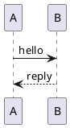

Crowi page bodies are written in Markdown. The Crowi 2.x renderer is built on
a **core pipeline that conforms to CommonMark + GFM (GitHub Flavored
Markdown)**, combined with a few Crowi-specific extensions and additional
installable **renderer plugins**.

See [RFC-0002: Renderer plugin architecture](../reference/rfcs) for the design
philosophy of the renderer.

## Basic Markdown

Standard CommonMark / GFM syntax — headings, lists, emphasis, links, tables,
code blocks, and so on — works as-is.

```markdown
# Heading 1
## Heading 2

- Bullet
- Bullet

**bold**, *italic*, and `inline code`

> Block quote

| Col A | Col B |
| ----- | ----- |
| 1     | 2     |
```

- A **table of contents (TOC)** is generated automatically from headings,
  and each heading gets a stable anchor ID. Duplicate heading texts are
  numbered automatically, and CJK headings can be used as anchors too.

## Crowi core extensions

The following syntax is enabled by default, with no plugin required.

### Wiki links `[[...]]`

You can write inter-page links with the `[[...]]` syntax.

| Input | Target | Display |
| ----- | ------ | ------- |
| `[[/dev/setup]]` | `/dev/setup` | `/dev/setup` |
| `[[Page]]` | `Page` | `Page` |
| `[[/dev/setup|Setup steps]]` | `/dev/setup` | `Setup steps` |
| `[[/dev/setup#macos]]` | `/dev/setup#macos` | `/dev/setup#macos` |

Absolute paths starting with `/` become regular links. Targets that do not
start with `/`, and external URLs such as `http(s)://`, are currently shown
dimmed as a "broken wiki link" (a `wikilink-broken` class is applied).

### Mentions `@username`

A `@username` in the body is automatically converted into a link to that
user's user page (`/user/<username>`).

- A username is recognised as `A-Za-z0-9_-` (up to 64 characters) right
  after the `@`.
- When the character before `@` is a word character — as in
  `me@example.com` — it is not treated as a mention (so email addresses are
  not falsely detected).
- Mentioned users receive a notification. See [Notifications](./notifications)
  for details.

### Embed tags `@[tag](url)`

The `@[tag](url)` syntax invokes an embed provided by a renderer plugin. When
no embed renderer is registered for `tag`, it is displayed as-is — `@`
followed by a plain inline link.

### Inline URL expansion

When you write a bare URL inside a paragraph, registered URL expansion rules
may expand that URL into a rich embedded display. A link with an explicit
label such as `[label](url)` is not expanded and is treated as a plain link.

> **Note**: What can actually be expanded by embed tags and inline URL
> expansion depends on the installed plugins. No expansion rule is provided
> by default.

### Code block syntax highlighting

A fenced code block with a language specified, such as ` ```ts `, is rendered
with syntax highlighting applied at save time.

## Extensions via renderer plugins

The following syntax only works when the corresponding **renderer plugin** is
enabled. See [Managing plugins](../plugins/managing) for how to manage
plugins.

### Emoji shortcodes — `@crowi/plugin-renderer-emoji`

Converts emoji shortcodes such as `:smile:` and `:rocket:` into Unicode
emoji.

```markdown
Hello :smile: world! :rocket:
```

- Recognised emoji come from GitHub's shortcode set and the Unicode CLDR
  aliases.
- Unknown shortcodes (such as `:not-emoji:`) are left as-is, so typos do not
  break rendering.
- `:smile:` inside fenced code blocks or inline code is not converted.
- For accessibility, each emoji is wrapped in
  `<span role="img" aria-label="...">`, so screen readers announce the emoji
  name.

### Math — `@crowi/plugin-renderer-katex`

Renders `$...$` (inline) and `$$...$$` (display) LaTeX math with KaTeX.

````markdown
The Pythagorean theorem: $a^2 + b^2 = c^2$

Display math:

$$
\int_0^1 x \,dx = \frac{1}{2}
$$
````

- Inline math is emitted as `<span class="katex-inline">` and display math
  as `<div class="katex-block">`.
- Only KaTeX standard commands are available. User-defined macros
  (`\newcommand`) and MathJax-style `\[ \]` / `\( \)` delimiters are not
  supported.

### PlantUML diagrams — `@crowi/plugin-renderer-plantuml`

Sends the content of a ` ```plantuml ` fenced code block to an
operator-configured PlantUML server and embeds the returned diagram into the
body.

````markdown

````

- Rendering requires a PlantUML server. The server URL is configured from
  the admin screen at `/admin/plugins` (see [Renderer plugins](../plugins/renderers)
  for the operational steps).
- Rendered results are cached so that a transient PlantUML server outage does
  not flood it with requests.

### Crowi v1 compatibility — `@crowi/plugin-renderer-crowi-legacy`

A compatibility plugin that lets **non-CommonMark writing habits from the
Crowi 1.x era** still render the same way in 2.x. Enable it only if you
migrated data from Crowi 1.x.

| Input | Plugin disabled (plain CommonMark) | Plugin enabled |
| ----- | ---------------------------------- | -------------- |
| `##hoge` | Paragraph `##hoge` (not a heading) | Heading depth 2 `hoge` |
| `###bar` | Paragraph `###bar` | Heading depth 3 `bar` |
| `## hoge` | Heading depth 2 `hoge` | Heading depth 2 `hoge` (not double-converted) |

It corrects the writing habit — common in the v1 era — of putting no space
right after the `#` in an ATX heading.

> **Note**: "Single newline → `<br>`" was originally provided by this plugin,
> but it has since been promoted to the default behaviour of the Crowi 2.x
> core pipeline. You no longer need this plugin just for line breaks.

## Related pages

- [Pages](./pages) — page basics
- [Managing plugins](../plugins/managing) — enabling renderer plugins
- [Renderer plugins](../plugins/renderers) — configuring renderer plugins
- [RFCs and architecture](../reference/rfcs) — RFC-0002 renderer design
