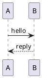
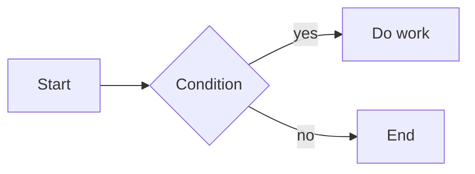

Crowi page bodies are written in Markdown. The Crowi 2.x renderer is built on
a **core pipeline that conforms to CommonMark + GFM (GitHub Flavored
Markdown)**, combined with a few Crowi-specific extensions and additional
installable **renderer plugins**.

See [RFC-0002: Renderer plugin architecture](../reference/rfcs) for the design
philosophy of the renderer.

## Basic Markdown

Standard CommonMark / GFM syntax — headings, lists, emphasis, links, tables,
code blocks, and so on — works as-is.

```markdown
# Heading 1
## Heading 2

- Bullet
- Bullet

**bold**, *italic*, and `inline code`

> Block quote

| Col A | Col B |
| ----- | ----- |
| 1     | 2     |
```

- A **table of contents (TOC)** is generated automatically from headings,
  and each heading gets a stable anchor ID. Duplicate heading texts are
  numbered automatically, and CJK headings can be used as anchors too.
- Each heading shows a small **anchor copy button** on hover. The
  default icon is `Link2`; once clicked it briefly switches to a
  `Check`, confirming the section URL has been copied to the
  clipboard.
- Inline `` `code` `` renders as a **GitHub-style muted pill** —
  monospaced text on a muted background with rounded corners.
- Long unbreakable tokens (commit SHAs, raw URLs) wrap inside
  paragraphs and list items rather than pushing the article past the
  viewport. Fenced `<pre>` code blocks are exempt and keep their
  horizontal scroll.
- Tables keep their column structure instead — a cell holding a long
  unbreakable token (a file path, an identifier) never wraps
  character-by-character. If a table ends up wider than its container,
  it scrolls horizontally on its own rather than stretching the page.
  This applies to both GFM `|...|` tables and raw HTML `<table>` written
  directly in the page body.

## Crowi core extensions

The following syntax is enabled by default, with no plugin required.

### Wiki links `[[...]]`

You can write inter-page links with the `[[...]]` syntax.

| Input | Target | Display |
| ----- | ------ | ------- |
| `[[/dev/setup]]` | `/dev/setup` | `/dev/setup` |
| `[[Page]]` | `Page` | `Page` |
| `[[/dev/setup|Setup steps]]` | `/dev/setup` | `Setup steps` |
| `[[/dev/setup#macos]]` | `/dev/setup#macos` | `/dev/setup#macos` |

Absolute paths starting with `/` become regular links. Targets that do not
start with `/`, and external URLs such as `http(s)://`, are currently shown
dimmed as a "broken wiki link" (a `wikilink-broken` class is applied).

### Mentions `@username`

A `@username` in the body is automatically converted into a link to that
user's user page (`/user/<username>`).

- A username is recognised as `A-Za-z0-9_-` (up to 64 characters) right
  after the `@`.
- When the character before `@` is a word character — as in
  `me@example.com` — it is not treated as a mention (so email addresses are
  not falsely detected).
- Mentioned users receive a notification. See [Notifications](./notifications)
  for details.

### Embed tags `@[tag](url)`

The `@[tag](url)` syntax invokes an embed provided by a renderer plugin. When
no embed renderer is registered for `tag`, it is displayed as-is — `@`
followed by a plain inline link.

#### Link cards `@[card](url)`

When the `@crowi/plugin-renderer-link-card` plugin is enabled, writing
`@[card](url)` fetches the target page's OGP meta tags (`og:title` /
`og:description` / `og:image` / `og:site_name`) and renders a link-preview
card.

```markdown
@[card](https://example.com/some-article)
```

- The card shows a title, description, domain, and (if available) a
  thumbnail image.
- A page with no `og:image` renders as a text-only card (title, description,
  domain — no image).
- If the fetch fails (timeout, 404, etc.), it degrades to a minimal error
  card that is still a working link to the URL — the link never loses its
  navigation function; if the card was shown before, a temporary failure
  keeps the previous card on screen.
- The editor helps with this conversion: hovering/focusing a bare URL shows
  "Convert to card"; hovering/focusing `@[card](url)` shows "Convert to
  link". This affordance is not shown for a link that already has an
  explicit label (`[label](url)`) — an authored label is respected.
- The editor's live preview (before saving) does not fetch real OGP data —
  it shows a static placeholder card with just the URL, and it is not
  clickable. The real card (title, description, image) is fetched after
  you save.
- The image is a direct link to the source site (no proxying or caching).
  See the `@crowi/plugin-renderer-link-card` README for plugin details and
  its SSRF safeguards.

### Inline URL expansion

When you write a bare URL inside a paragraph, registered URL expansion rules
may expand that URL into a rich embedded display. A link with an explicit
label such as `[label](url)` is not expanded and is treated as a plain link.

> **Note**: What can actually be expanded by embed tags and inline URL
> expansion depends on the installed plugins. No expansion rule is provided
> by default.

### Code block syntax highlighting

A fenced code block with a language specified, such as ` ```ts `, is rendered
with syntax highlighting applied at save time.

### Image display attributes `{width= height= align= float=}`

You can follow an image `` with a Pandoc-style attribute block to
set its width, height, alignment, and text-wrap float
([RFC-0015](https://github.com/crowi/crowi/blob/main/docs/rfcs/0015-image-display-attributes.md)).

```markdown
{width=60%}
```

- Between the image and the `{` you can have zero or more ASCII
  spaces/tabs, or exactly one soft line break followed by spaces/tabs.
  Anything else — two or more soft breaks, non-whitespace text before
  the `{`, or a space right after the opening brace as in
  `{ width=60%}` — is not recognised as an attribute block and is left
  as plain text.
- Only these 4 attributes are supported:

  | Attribute | Accepted values | Meaning |
  | --------- | ------------------------------------------ | -------------------------------------------- |
  | `width` | `<number>%` (1–100) or `<number>px` (1–4096) | Image width |
  | `height` | `<number>%` (1–100) or `<number>px` (1–4096) | Image height |
  | `align` | `left` / `center` / `right` | Block placement (**standalone images only**) |
  | `float` | `left` / `right` | Text-wrap float (**standalone images only**, wins over `align`) |

- An out-of-range value (`width=200%`, `height=5000px`, etc.), a
  non-numeric value, or an unrecognised key is simply **ignored for
  that one attribute** — it is dropped, never clamped. The image itself
  never disappears and the page never breaks. If no attribute in the
  block ends up valid, the original Markdown renders exactly as if the
  attribute block were absent.
- When both `align` and `float` are set, `float` wins.

**Standalone (figure) vs. inline images**:

- When the image plus its attribute block is the **only content in its
  paragraph** (no other text or image around it), it renders as a
  `<figure>` and `align` / `float` apply.
- When text follows the image on the same line (an inline image), only
  `width` / `height` apply — `align` / `float` are ignored, since
  block-level placement and text-wrap have no coherent meaning for an
  image in the middle of a sentence.
- v1 does not support a `caption` syntax; no `<figcaption>` is emitted.

```markdown
{width=70% align=center}

Placed mid-sentence it stays inline: {width=24px} like so.

Float to the right: {width=200px float=right}
```

An image with `float` set collapses back to a normal, full-width block
(no wrap) on narrow screens (below 768px). A float is also always
cleared at the next section heading (`#`–`######`), so a heading after a
floated image starts below it rather than beside it.

**Editor affordance**: hovering over (or placing the cursor inside) an
image's Markdown span shows a small tooltip with `width` / `align` /
`float` controls. `align` / `float` are only offered for a standalone
image, matching the semantics above. Using the tooltip rewrites the
`{...}` block for you. The tooltip does not appear when the page is
read-only.

> **Note**: The attachment insert button still inserts a plain
> `` with no attributes. Add a
> `{...}` block by hand afterward if you want to set its size or
> placement (see [Attachments](./attachments)).

## Extensions via renderer plugins

The following syntax only works when the corresponding **renderer plugin** is
enabled. See [Managing plugins](../plugins/managing) for how to manage
plugins.

### Emoji shortcodes — `@crowi/plugin-renderer-emoji`

Converts emoji shortcodes such as `:smile:` and `:rocket:` into Unicode
emoji.

```markdown
Hello :smile: world! :rocket:
```

- Recognised emoji come from GitHub's shortcode set and the Unicode CLDR
  aliases.
- Unknown shortcodes (such as `:not-emoji:`) are left as-is, so typos do not
  break rendering.
- `:smile:` inside fenced code blocks or inline code is not converted.
- For accessibility, each emoji is wrapped in
  `<span role="img" aria-label="...">`, so screen readers announce the emoji
  name.

### Math — `@crowi/plugin-renderer-katex`

Renders `$...$` (inline) and `$$...$$` (display) LaTeX math with KaTeX.

````markdown
The Pythagorean theorem: $a^2 + b^2 = c^2$

Display math:

$$
\int_0^1 x \,dx = \frac{1}{2}
$$
````

- Inline math is emitted as `<span class="katex-inline">` and display math
  as `<div class="katex-block">`.
- Only KaTeX standard commands are available. User-defined macros
  (`\newcommand`) and MathJax-style `\[ \]` / `\( \)` delimiters are not
  supported.

### PlantUML diagrams — `@crowi/plugin-renderer-plantuml`

Sends the content of a ` ```plantuml ` fenced code block to an
operator-configured PlantUML server and embeds the returned diagram into the
body.

````markdown

````

- Rendering requires a PlantUML server. The server URL is configured from
  the admin screen at `/admin/plugins` (see [Renderer plugins](../plugins/renderers)
  for the operational steps).
- Rendered results are cached so that a transient PlantUML server outage does
  not flood it with requests.

### Mermaid diagrams — `@crowi/plugin-renderer-mermaid`

Renders the content of a ` ```mermaid ` fenced code block server-side and
embeds the resulting SVG into the body.

````markdown

````

- Supports Mermaid's main diagram types: flowchart, sequence, class, state,
  ER, journey, pie, and git-graph.
- Unlike PlantUML, no external server and no operator configuration are
  needed — if the plugin is enabled, just write the fence.
- Diagrams also render in the editor's live preview, so you can check them
  before saving.
- The editor and preview stay scroll-synced — scrolling either one brings the
  corresponding line into view on the other side.
- Diagram source is limited to 20KB. A diagram with a syntax error shows a
  fixed error placeholder. For the other limits and the security design,
  see the Mermaid section of [Renderer plugins](../plugins/renderers).
- ` ```mermaid ` fences saved before the plugin was enabled keep rendering
  as plain code blocks until the page is re-saved.

### Crowi v1 compatibility — `@crowi/plugin-renderer-crowi-legacy`

A compatibility plugin that lets **non-CommonMark writing habits from the
Crowi 1.x era** still render the same way in 2.x. Enable it only if you
migrated data from Crowi 1.x.

| Input | Plugin disabled (plain CommonMark) | Plugin enabled |
| ----- | ---------------------------------- | -------------- |
| `##hoge` | Paragraph `##hoge` (not a heading) | Heading depth 2 `hoge` |
| `###bar` | Paragraph `###bar` | Heading depth 3 `bar` |
| `## hoge` | Heading depth 2 `hoge` | Heading depth 2 `hoge` (not double-converted) |

It corrects the writing habit — common in the v1 era — of putting no space
right after the `#` in an ATX heading.

> **Note**: "Single newline → `<br>`" was originally provided by this plugin,
> but it has since been promoted to the default behaviour of the Crowi 2.x
> core pipeline. You no longer need this plugin just for line breaks.

## Related pages

- [Pages](./pages) — page basics
- [Managing plugins](../plugins/managing) — enabling renderer plugins
- [Renderer plugins](../plugins/renderers) — configuring renderer plugins
- [RFCs and architecture](../reference/rfcs) — RFC-0002 renderer design
