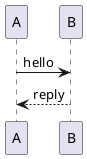

Crowi のページ本文は Markdown で記述します。Crowi 2.x のレンダラは
**CommonMark + GFM(GitHub Flavored Markdown)準拠のコアパイプライン**を
ベースに、いくつかの Crowi 独自拡張と、追加でインストール可能な
**レンダラプラグイン**を組み合わせて動作します。

レンダラの設計思想は [RFC-0002: レンダラプラグインアーキテクチャ](../reference/rfcs)
を参照してください。

## 基本の Markdown

見出し・リスト・強調・リンク・テーブル・コードブロックなど、標準的な
CommonMark / GFM 記法はそのまま使えます。

```markdown
# 見出し1
## 見出し2

- 箇条書き
- 箇条書き

**太字** と *斜体* と `インラインコード`

> 引用文

| 列A | 列B |
| --- | --- |
| 1   | 2   |
```

- 見出しからは自動的に **目次(TOC)** が生成され、各見出しには安定した
  アンカー ID が付与されます。同じ見出しテキストが複数あっても自動で
  連番が振られ、日本語見出しもアンカーとして使えます。

## Crowi 独自のコア拡張

以下の記法は、プラグインを入れなくても標準で有効です。

### Wiki リンク `[[...]]`

`[[...]]` 記法でページ間リンクを書けます。

| 入力 | リンク先 | 表示 |
| ---- | -------- | ---- |
| `[[/dev/setup]]` | `/dev/setup` | `/dev/setup` |
| `[[Page]]` | `Page` | `Page` |
| `[[/dev/setup|セットアップ手順]]` | `/dev/setup` | `セットアップ手順` |
| `[[/dev/setup#macos]]` | `/dev/setup#macos` | `/dev/setup#macos` |

`/` で始まる絶対パスは通常のリンクになります。`/` で始まらないターゲットや
`http(s)://` のような外部 URL は、現状では「壊れた wiki リンク」として
薄く表示されます(`wikilink-broken` クラスが付与されます)。

エディタで `[[` を入力すると、ページを検索する入力補完が起動します
(下記「入力補完」参照)。候補を選ぶと、閉じ括弧まで含めた
`[[/full/path]]` が挿入されます。

### メンション `@username`

本文中の `@username` は、自動的にそのユーザーのユーザーページ
(`/user/<username>`)へのリンクに変換されます。

- ユーザー名として認識されるのは `@` の直後の `A-Za-z0-9_-`(最大 64 文字)です。
- `me@example.com` のように `@` の前が単語文字の場合はメンション扱いに
  なりません(メールアドレスを誤検出しないため)。
- メンションされたユーザーには通知が届きます。詳しくは
  [通知](./notifications) を参照してください。

エディタで `@` に続けて 1 文字以上を入力すると、ユーザーを検索する
入力補完が起動します(下記「入力補完」参照)。

## エディタの入力補完 (autocomplete)

ページ編集画面のエディタには、メンションと wiki リンクの **入力補完**
があります。`@` または `[[` を入力すると、カーソルの下に候補ドロップ
ダウンが表示されます。

| トリガ | 対象 | 挿入されるもの |
| ------ | ---- | -------------- |
| `@` + ユーザー名文字(英数字 / `_` / `-`)を 1 文字以上 | ユーザー検索 | `@username` |
| `[[` + 1 文字以上 | ページ検索 | `[[/full/path]]`(閉じ括弧込み) |

- 候補は **上下キー** で移動し、**Enter** または **Tab** で確定します。
  ドロップダウンに表示されるのは「アバター + 表示名 + `@username`」や
  「ページのパス + タイトル + 更新日時」ですが、本文に挿入されるのは
  `@username` / `[[/full/path]]` のような短い正規形です。
- ドロップダウン下部の **「Refresh results」** を押すと、クライアント側
  キャッシュを無視してサーバへ再問い合わせします。新しく追加された
  ユーザーやページがまだ候補に出ないときに使います。
- 次の場合はドロップダウンが閉じます: Escape を押す / ドロップダウンの
  外をクリックする / 候補が 0 件 / 補完シーケンスを終える文字(空白や
  記号)を入力する。

補完が **起動しない** ケース:

- 単独の `@`(直後に文字がない状態)。これは埋め込みタグ `@[tag](url)`
  との混同を避けるためです。
- `@` がメールアドレスのように単語の途中にあるとき(行頭・空白・記号の
  直後でないと起動しません)。
- コードブロック・インラインコード・数式 (`$$ … $$`)・リンク記法
  (`[text](url)`)の内側。
- 内容を貼り付け (paste) したとき。補完はキーボード入力にのみ反応します。
- **モバイル幅の画面**(横幅 768px 未満)。モバイルではキーボードと
  ドロップダウンが重なって扱いにくいため補完を無効にしています。
  モバイルでも `@username` や `[[/docs/api]]` を手入力すれば、保存
  される Markdown は同じです。

> **Note**: ページの入力補完では、他人の[下書きページ](./pages)は
> 候補に出ません(作成者本人には出ます)。`[[Page#section]]` の
> セクションアンカーは補完されないため、`#section` 部分は手入力して
> ください。

### 埋め込みタグ `@[tag](url)`

`@[tag](url)` という記法で、レンダラプラグインが提供する埋め込みを
呼び出せます。`tag` に対応する埋め込みレンダラが登録されていない場合は、
`@` + 通常のインラインリンクとしてそのまま表示されます。

### URL のインライン展開

段落中に裸の URL を書くと、登録された URL 展開ルールによって、その URL が
リッチな埋め込み表示に展開される場合があります。`[ラベル](url)` のように
明示的にラベルを付けたリンクは展開されず、そのままリンクとして扱われます。

> **Note**: 埋め込みタグと URL インライン展開で何が実際に展開できるかは、
> インストールされているプラグインに依存します。標準では展開ルールは
> 提供されません。

### コードブロックのシンタックスハイライト

` ```ts ` のように言語を指定したフェンスドコードブロックは、保存時に
シンタックスハイライト済みの形で描画されます。

## レンダラプラグインによる拡張

以下の記法は、対応する **レンダラプラグイン** を有効にしたときだけ
動作します。プラグインの管理方法は [プラグインの管理](../plugins/managing)
を参照してください。

### 絵文字ショートコード — `@crowi/plugin-renderer-emoji`

`:smile:` `:rocket:` のような絵文字ショートコードを Unicode 絵文字に
変換します。

```markdown
Hello :smile: world! :rocket:
```

- 認識される絵文字は GitHub のショートコードセットおよび Unicode CLDR
  エイリアスです。
- 未知のショートコード(`:not-emoji:` など)はそのまま残るため、タイプミス
  でも表示が壊れません。
- フェンスドコードブロック内・インラインコード内の `:smile:` は変換され
  ません。
- アクセシビリティのため、各絵文字は `<span role="img" aria-label="...">`
  でラップされ、スクリーンリーダーが絵文字名を読み上げます。

### 数式 — `@crowi/plugin-renderer-katex`

`$...$`(インライン)と `$$...$$`(ディスプレイ)の LaTeX 数式を
KaTeX で描画します。

````markdown
ピタゴラスの定理: $a^2 + b^2 = c^2$

ディスプレイ数式:

$$
\int_0^1 x \,dx = \frac{1}{2}
$$
````

- インライン数式は `<span class="katex-inline">`、ディスプレイ数式は
  `<div class="katex-block">` で出力されます。
- 描画には KaTeX の標準コマンドのみが使えます。ユーザー定義マクロ
  (`\newcommand`)や MathJax 形式の `\[ \]` / `\( \)` 区切りには
  対応していません。

### PlantUML 図 — `@crowi/plugin-renderer-plantuml`

` ```plantuml ` フェンスドコードブロックの内容を、運用者が設定した
PlantUML サーバへ送信し、返ってきた図を本文に埋め込みます。

````markdown

````

- 描画には PlantUML サーバが必要です。サーバ URL は管理画面の
  `/admin/plugins` から設定します(運用手順は
  [レンダラプラグイン](../plugins/renderers) を参照)。
- 描画結果はキャッシュされ、PlantUML サーバの一時的な障害でサーバへ
  リクエストが殺到しないようになっています。

### Crowi v1 互換 — `@crowi/plugin-renderer-crowi-legacy`

Crowi 1.x 時代の **CommonMark 準拠ではない書き癖** を、2.x でも従来どおり
描画できるようにする互換プラグインです。Crowi 1.x からデータを移行して
きた場合のみ有効化してください。

| 入力 | プラグイン無効(素の CommonMark) | プラグイン有効 |
| ---- | ------------------------------- | -------------- |
| `##hoge` | 段落 `##hoge`(見出しにならない) | 見出し深さ2 `hoge` |
| `###bar` | 段落 `###bar` | 見出し深さ3 `bar` |
| `## hoge` | 見出し深さ2 `hoge` | 見出し深さ2 `hoge`(二重変換しない) |

ATX 見出しの `#` の直後に空白を入れない、という v1 時代に多かった
書き癖を補正します。

> **Note**: 「シングル改行 → `<br>`」は、当初このプラグインが提供して
> いましたが、現在は Crowi 2.x のコアパイプラインのデフォルト挙動に
> 格上げされています。改行のためにこのプラグインを入れる必要はありません。

## 関連ページ

- [ページの作成と編集](./pages) — ページの基本
- [プラグインの管理](../plugins/managing) — レンダラプラグインの有効化
- [レンダラプラグイン](../plugins/renderers) — レンダラプラグインの設定
- [RFC とアーキテクチャ](../reference/rfcs) — RFC-0002 レンダラ設計
