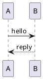
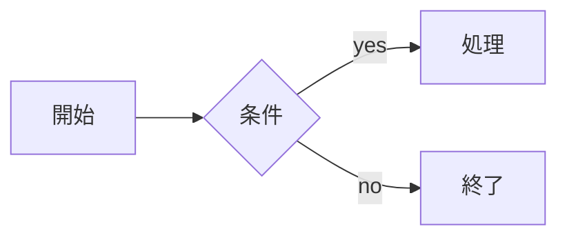

Crowi のページ本文は Markdown で記述します。Crowi 2.x のレンダラは
**CommonMark + GFM(GitHub Flavored Markdown)準拠のコアパイプライン**を
ベースに、いくつかの Crowi 独自拡張と、追加でインストール可能な
**レンダラプラグイン**を組み合わせて動作します。

レンダラの設計思想は [RFC-0002: レンダラプラグインアーキテクチャ](../reference/rfcs)
を参照してください。

## 基本の Markdown

見出し・リスト・強調・リンク・テーブル・コードブロックなど、標準的な
CommonMark / GFM 記法はそのまま使えます。

```markdown
# 見出し1
## 見出し2

- 箇条書き
- 箇条書き

**太字** と *斜体* と `インラインコード`

> 引用文

| 列A | 列B |
| --- | --- |
| 1   | 2   |
```

- 見出しからは自動的に **目次(TOC)** が生成され、各見出しには安定した
  アンカー ID が付与されます。同じ見出しテキストが複数あっても自動で
  連番が振られ、日本語見出しもアンカーとして使えます。
- 各見出しの横には、ホバー時に小さな **アンカーコピーボタン** が
  表示されます。アイコンは通常 `Link2` で、押すと一時的に `Check`
  に切り替わり、その見出しの URL がクリップボードへコピーされた
  ことを知らせます。
- インラインの `` `code` `` は **GitHub 風のミュートしたピル** で
  描画されます — 等幅フォント、ミュート色の背景、角丸の小さな囲み
  です。
- コミットの SHA や生 URL のような長くて改行できないトークンは、
  段落やリスト項目の中で折り返されます。記事が viewport をはみ出して
  右へずれることはありません。フェンスドコードブロック (`<pre>`)
  はこの対象外で、従来どおり横スクロールします。
- テーブルは列構造を保ったまま表示されます。長くて改行できない
  トークン(ファイルパスや識別子など)を含むセルが、1 文字ずつ縦に
  折り返されることはありません。テーブル全体がコンテナ幅より広く
  なった場合は、ページを広げるのではなくテーブル自身が横スクロール
  します。これは GFM の `|...|` テーブルでも、本文に直接書いた raw
  HTML の `<table>` でも同じです。

## Crowi 独自のコア拡張

以下の記法は、プラグインを入れなくても標準で有効です。

### Wiki リンク `[[...]]`

`[[...]]` 記法でページ間リンクを書けます。

| 入力 | リンク先 | 表示 |
| ---- | -------- | ---- |
| `[[/dev/setup]]` | `/dev/setup` | `/dev/setup` |
| `[[Page]]` | `Page` | `Page` |
| `[[/dev/setup|セットアップ手順]]` | `/dev/setup` | `セットアップ手順` |
| `[[/dev/setup#macos]]` | `/dev/setup#macos` | `/dev/setup#macos` |

`/` で始まる絶対パスは通常のリンクになります。`/` で始まらないターゲットや
`http(s)://` のような外部 URL は、現状では「壊れた wiki リンク」として
薄く表示されます(`wikilink-broken` クラスが付与されます)。

エディタで `[[` を入力すると、ページを検索する入力補完が起動します
(下記「入力補完」参照)。候補を選ぶと、閉じ括弧まで含めた
`[[/full/path]]` が挿入されます。

### スペースを含むページへの通常リンク

Crowi のページ path はスペースを含められますが、通常の Markdown リンク
`[label](url)` の destination(丸括弧の中)には CommonMark の仕様上、
生のスペースをそのまま書くことはできません。スペースを含むページへ
リンクしたい場合は、次のいずれかの記法を使ってください。

| 記法 | 例 | 備考 |
| ---- | -- | ---- |
| `%20`(推奨) | `[AIレポート](/survey/AIレポート%20ドラフト)` | RFC 3986 上明示的に妥当で、Pandoc など外部の Markdown ツールとの互換性が最も高い |
| `+` | `[週次レポート](/crowi/週次レポート+2026+07)` | Crowi の URL がスペースを `+` で表す慣習に合わせた書き方。引き続きサポートされる |
| `<...>`(angle-bracket) | `[label](</foo bar>)` | CommonMark 標準の angle-bracket destination。スペースをそのまま書ける |

destination に生のスペースをそのまま書いた `[label](/foo bar)` はリンクに
ならず、入力した文字列がそのまま表示されます(CommonMark の仕様どおりです)。

### メンション `@username`

本文中の `@username` は、自動的にそのユーザーのユーザーページ
(`/user/<username>`)へのリンクに変換されます。

- ユーザー名として認識されるのは `@` の直後の `A-Za-z0-9_-`(最大 64 文字)です。
- `me@example.com` のように `@` の前が単語文字の場合はメンション扱いに
  なりません(メールアドレスを誤検出しないため)。
- メンションされたユーザーには通知が届きます。詳しくは
  [通知](./notifications) を参照してください。

エディタで `@` に続けて 1 文字以上を入力すると、ユーザーを検索する
入力補完が起動します(下記「入力補完」参照)。

### 絵文字ショートコード

`:smile:` `:rocket:` のような絵文字ショートコードを Unicode 絵文字に
変換します。インストール不要で常時有効な Crowi コアの機能です。

```markdown
Hello :smile: world! :rocket:
```

- 認識される絵文字は GitHub のショートコードセットおよび Unicode CLDR
  エイリアスです。
- 未知のショートコード(`:not-emoji:` など)はそのまま残るため、タイプミス
  でも表示が壊れません。
- フェンスドコードブロック内・インラインコード内の `:smile:` は変換され
  ません。
- アクセシビリティのため、各絵文字は `<span role="img" aria-label="...">`
  でラップされ、スクリーンリーダーが絵文字名を読み上げます。

## エディタの入力補完 (autocomplete)

ページ編集画面のエディタには、メンションと wiki リンクの **入力補完**
があります。`@` または `[[` を入力すると、カーソルの下に候補ドロップ
ダウンが表示されます。

| トリガ | 対象 | 挿入されるもの |
| ------ | ---- | -------------- |
| `@` + ユーザー名文字(英数字 / `_` / `-`)を 1 文字以上 | ユーザー検索 | `@username` |
| `[[` + 1 文字以上 | ページ検索 | `[[/full/path]]`(閉じ括弧込み) |

- 候補は **上下キー** で移動し、**Enter** または **Tab** で確定します。
  ドロップダウンに表示されるのは「アバター + 表示名 + `@username`」や
  「ページのパス + タイトル + 更新日時」ですが、本文に挿入されるのは
  `@username` / `[[/full/path]]` のような短い正規形です。
- ドロップダウン下部の **「Refresh results」** を押すと、クライアント側
  キャッシュを無視してサーバへ再問い合わせします。新しく追加された
  ユーザーやページがまだ候補に出ないときに使います。
- 次の場合はドロップダウンが閉じます: Escape を押す / ドロップダウンの
  外をクリックする / 候補が 0 件 / 補完シーケンスを終える文字(空白や
  記号)を入力する。

補完が **起動しない** ケース:

- 単独の `@`(直後に文字がない状態)。これは埋め込みタグ `@[tag](url)`
  との混同を避けるためです。
- `@` がメールアドレスのように単語の途中にあるとき(行頭・空白・記号の
  直後でないと起動しません)。
- コードブロック・インラインコード・数式 (`$$ … $$`)・リンク記法
  (`[text](url)`)の内側。
- 内容を貼り付け (paste) したとき。補完はキーボード入力にのみ反応します。
- **モバイル幅の画面**(横幅 768px 未満)。モバイルではキーボードと
  ドロップダウンが重なって扱いにくいため補完を無効にしています。
  モバイルでも `@username` や `[[/docs/api]]` を手入力すれば、保存
  される Markdown は同じです。

> **Note**: ページの入力補完では、他人の[下書きページ](./pages)は
> 候補に出ません(作成者本人には出ます)。`[[Page#section]]` の
> セクションアンカーは補完されないため、`#section` 部分は手入力して
> ください。

### 埋め込みタグ `@[tag](url)`

`@[tag](url)` という記法で、埋め込み表示を呼び出せます。`card` は
Crowi コア自身が予約している組み込みタグで、それ以外の `tag` はレンダラ
プラグインが提供します。`tag` に対応する埋め込みレンダラが登録されて
いない場合は、`@` + 通常のインラインリンクとしてそのまま表示されます。

#### リンクカード `@[card](url)`

`@[card](url)` と書くと、URL 先のページの OGP メタタグ(`og:title` /
`og:description` / `og:image` / `og:site_name`)を取得してリンクカードを
表示します。インストール不要で常時有効な Crowi コアの機能です
(詳細は [レンダラプラグイン](../plugins/renderers) の「コアに組み込まれた
Markdown 機能」を参照)。

```markdown
@[card](https://example.com/some-article)
```

- タイトル・説明文・ドメイン・(あれば)サムネイル画像を含むカードとして
  表示されます。
- `og:image` が無いページは、画像なしのテキストカード(タイトル・説明文・
  ドメインのみ)になります。
- 管理画面の「セキュリティ」→「外部リンクのカード化を許可する」で
  この機能自体を無効化できます(既定は有効)。無効化されている場合、
  OGP 取得に失敗した場合、外部到達できない場合のいずれも、URL のみを
  タイトルとして表示する統一フォールバックカードになります — OGP の
  タイトル・説明文・画像は含まず、エラーを示す赤い装飾もありませんが、
  リンクとしては引き続き機能します。過去にカードが表示できていた場合、
  一時的な取得失敗では直前のカードがそのまま表示され続けます。
- カードの編集は編集画面上のエディタ支援で行えます: 裸の URL にカーソルを
  合わせると「カードに変換」、`@[card](url)` にカーソルを合わせると
  「リンクに戻す」が表示されます。`[ラベル](url)` のように既にラベルを
  付けたリンクにはこの支援は表示されません(著者が選んだラベルを尊重する
  ため)。
- 保存前の編集中ライブプレビューでは実際の OGP 取得は行わず、URL のみを
  示す静的なプレースホルダーカードとして表示されます(クリックしても
  遷移しません)。タイトル・説明文・画像を含む本来のカードは保存後に
  取得されます。このプレースホルダーは、上記の統一フォールバックカードと
  意図的に同じ見た目です。
- 画像は取得元サイトへの直リンクです(画像のプロキシ・キャッシュ配信は
  行いません)。SSRF 対策の詳細は [レンダラプラグイン](../plugins/renderers)
  を参照してください。

### URL のインライン展開

段落中に裸の URL を書くと、登録された URL 展開ルールによって、その URL が
リッチな埋め込み表示に展開される場合があります。`[ラベル](url)` のように
明示的にラベルを付けたリンクは展開されず、そのままリンクとして扱われます。

> **Note**: 埋め込みタグと URL インライン展開で何が実際に展開できるかは、
> インストールされているプラグインに依存します。標準では展開ルールは
> 提供されません。

### コードブロックのシンタックスハイライト

` ```ts ` のように言語を指定したフェンスドコードブロックは、保存時に
シンタックスハイライト済みの形で描画されます。

### 画像の表示属性 `{width= height= align= float=}`

画像 Markdown `` の直後に、Pandoc 風の属性ブロックを続けて
書くと、幅・高さ・整列・回り込みを指定できます
([RFC-0015](https://github.com/crowi/crowi/blob/main/docs/rfcs/0015-image-display-attributes.md))。

```markdown
{width=60%}
```

- 画像と `{` の間には、半角スペース / タブを 0 個以上、または改行 1 個
  + 半角スペース/タブを置けます。それ以外(改行 2 個以上、`{` の前に
  無関係な文字がある、`{ width=60%}` のように `{` の直後にスペースが
  あるなど)は属性ブロックとして認識されず、そのまま通常のテキストとして
  表示されます。
- 使える属性は次の 4 つだけです。

  | 属性 | 使える値 | 説明 |
  | ------ | -------------------------------------------- | ---------------------------------------- |
  | `width` | `<数値>%`(1〜100)または `<数値>px`(1〜4096) | 画像の幅 |
  | `height` | `<数値>%`(1〜100)または `<数値>px`(1〜4096) | 画像の高さ |
  | `align` | `left` / `center` / `right` | 画像の配置(**単独画像のみ**) |
  | `float` | `left` / `right` | 本文の回り込み(**単独画像のみ**、`align` より優先) |

- 範囲外の値(`width=200%`、`height=5000px` など)・数値でない値・
  認識できないキーは **その属性だけ無視されます**(cap されるのでは
  なく無効になります)。画像自体が消えたりページの表示が壊れたりする
  ことはありません。有効な属性が 1 つもなければ、元の Markdown は
  属性ブロックなしの通常の画像としてそのまま表示されます。
- `align` と `float` を両方指定した場合は `float` が優先されます。

**単独画像(figure)と文中画像の違い**:

- 画像 + 属性ブロックが **段落内で唯一の内容** のとき(前後に他の
  テキストや画像がない)、その画像は `<figure>` として描画され、
  `align` / `float` が適用されます。
- 画像の後ろに文章が続く場合(文中画像)は `width` / `height` のみが
  適用され、`align` / `float` は無視されます。ブロックレベルの配置・
  回り込みは、文中の画像には意味を持たないためです。
- v1 では `caption`(キャプション)記法はサポートしていません。
  `<figcaption>` は生成されません。

```markdown
{width=70% align=center}

文中に置くとインライン画像になります: {width=24px} のように。

右回り込みで表示: {width=200px float=right}
```

`float` を指定した画像は、画面幅が狭い(768px 未満)ときは回り込みを
解除し、通常のブロック要素として幅いっぱいに表示されます。また、次の
見出し(`#`〜`######`)の位置で回り込みは必ず解除され、見出しは画像の
横ではなく下から始まります。

**エディタでの操作**: 画像の Markdown 記法にカーソルを合わせる(または
ホバーする)と、`width` / `align` / `float` を操作できる小さなツール
チップが表示されます。`align` / `float` は単独画像のときだけ選択でき
ます(上記のとおり文中画像では効果がないため)。ツールチップから操作
すると `{...}` ブロックが自動で書き換えられます。ページが読み取り専用
のときはツールチップは表示されません。

> **Note**: 添付ファイルの挿入ボタンは、これまでどおり属性なしの
> `` を挿入します。サイズや
> 配置を指定したい場合は、挿入後に手動で `{...}` ブロックを追加して
> ください(詳しくは[添付ファイル](./attachments)を参照)。

## レンダラプラグインによる拡張

以下の記法は、対応する **レンダラプラグイン** を有効にしたときだけ
動作します。プラグインの管理方法は [プラグインの管理](../plugins/managing)
を参照してください。

### 数式 — `@crowi/plugin-renderer-katex`

`$...$`(インライン)と `$$...$$`(ディスプレイ)の LaTeX 数式を
KaTeX で描画します。

````markdown
ピタゴラスの定理: $a^2 + b^2 = c^2$

ディスプレイ数式:

$$
\int_0^1 x \,dx = \frac{1}{2}
$$
````

- インライン数式は `<span class="katex-inline">`、ディスプレイ数式は
  `<div class="katex-block">` で出力されます。
- 描画には KaTeX の標準コマンドのみが使えます。ユーザー定義マクロ
  (`\newcommand`)や MathJax 形式の `\[ \]` / `\( \)` 区切りには
  対応していません。

### PlantUML 図 — `@crowi/plugin-renderer-plantuml`

` ```plantuml ` フェンスドコードブロックの内容を、運用者が設定した
PlantUML サーバへ送信し、返ってきた図を本文に埋め込みます。

````markdown

````

- 描画には PlantUML サーバが必要です。サーバ URL は管理画面の
  `/admin/plugins` から設定します(運用手順は
  [レンダラプラグイン](../plugins/renderers) を参照)。
- 描画結果はキャッシュされ、PlantUML サーバの一時的な障害でサーバへ
  リクエストが殺到しないようになっています。

### Mermaid 図 — `@crowi/plugin-renderer-mermaid`

` ```mermaid ` フェンスドコードブロックの内容を、サーバ内で描画して SVG として本文に埋め込みます。

````markdown

````

- flowchart / sequence / class / state / ER / journey / pie / git-graph など、Mermaid の主要な図の種類に対応します。
- PlantUML と違って外部サーバは不要で、運用者による設定もありません — プラグインが有効なら書くだけで使えます。
- 編集中のライブプレビューでも描画されます(保存前に図を確認できます)。
- エディタとプレビューはスクロール位置が同期します。どちらをスクロールしても、対応する行が反対側にも表示されます。
- 図のソースは 20KB までです。記法エラーのある図は固定のエラー表示になります。そのほかの制限値やセキュリティ上の設計は [レンダラプラグイン](../plugins/renderers) の Mermaid 節を参照してください。
- プラグイン有効化より前に保存されたページの ` ```mermaid ` フェンスは、再保存するまでコードブロックのまま表示されます。

### Crowi v1 互換 — `@crowi/plugin-renderer-crowi-legacy`

Crowi 1.x 時代の **CommonMark 準拠ではない書き癖** を、2.x でも従来どおり
描画できるようにする互換プラグインです。Crowi 1.x からデータを移行して
きた場合のみ有効化してください。

| 入力 | プラグイン無効(素の CommonMark) | プラグイン有効 |
| ---- | ------------------------------- | -------------- |
| `##hoge` | 段落 `##hoge`(見出しにならない) | 見出し深さ2 `hoge` |
| `###bar` | 段落 `###bar` | 見出し深さ3 `bar` |
| `## hoge` | 見出し深さ2 `hoge` | 見出し深さ2 `hoge`(二重変換しない) |

ATX 見出しの `#` の直後に空白を入れない、という v1 時代に多かった
書き癖を補正します。

> **Note**: 「シングル改行 → `<br>`」は、当初このプラグインが提供して
> いましたが、現在は Crowi 2.x のコアパイプラインのデフォルト挙動に
> 格上げされています。改行のためにこのプラグインを入れる必要はありません。

## 関連ページ

- [ページの作成と編集](./pages) — ページの基本
- [プラグインの管理](../plugins/managing) — レンダラプラグインの有効化
- [レンダラプラグイン](../plugins/renderers) — レンダラプラグインの設定
- [RFC とアーキテクチャ](../reference/rfcs) — RFC-0002 レンダラ設計
