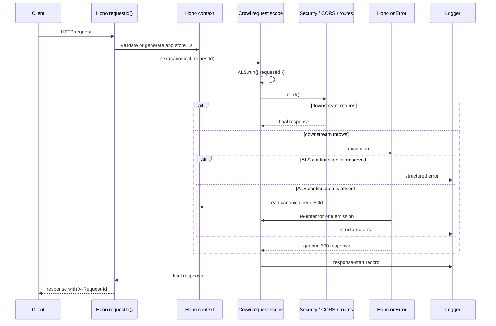

# RFC-0025: Crowi API structured logging and request correlation

- **Status**: Draft
- **Created**: 2026-09-08
- **Related**:
  - RFC-0006 (HTTP API Framework Migration) — establishes the global Hono application and error boundary extended here.

## §0 Summary

Crowi's API will emit newline-delimited JSON (NDJSON) operational logs through a narrow four-level logger and correlate request-scoped records with a validated `X-Request-Id`. This RFC fixes four API-wide contracts: the log envelope, request-scope propagation, the request-ID trust boundary, and a boundary-first migration policy.

The envelope is an operator-facing compatibility contract. Crowi is self-hosted OSS, so operators will build parsers, service-manager rules, and Fluent Bit pipelines around its field names and types. Those consumers must not be forced to track incidental implementation changes.

Hono context is the canonical source of the selected request ID. `AsyncLocalStorage` (ALS) mirrors that ID through the request's asynchronous call chain so module-level loggers in handlers, services, models, and utilities can attach it without accepting Hono `Context` or explicit logger parameters. Crowi will initially own the small serializer and process-stream sink. Serialization and writing are isolated behind one replaceable function so Pino can replace that implementation without changing call sites.

Migration is incremental. The first implementation slice covers the HTTP request boundary, the Hono catch-all error path, and fatal process boundaries; it does not convert every existing `Debug()` or `console.*` call. Existing call sites move when their domain is intentionally touched.

## §1 Motivation and current state

Crowi currently has two incompatible diagnostic mechanisms: `debug` namespaces that disappear unless `DEBUG` enables them, and unstructured `console.*` writes. A current TypeScript AST inventory found 81 production `Debug(...)` factories and 66 production `console.log|warn|error(...)` calls, but the exact counts are not the architectural issue. The problem is that neither mechanism provides a stable machine-readable envelope or request correlation.

The most consequential gap is the global Hono error path. `honoOnError` records an escaped exception only through a debug-gated call and then returns the generic `INTERNAL_ERROR` response (`packages/api/src/hono/middleware/error-handler.ts:23-31`). In a normal production configuration, an unhandled 500 can therefore leave no server-side diagnostic record. The generic client response is correct and remains unchanged; the missing operational record is not.

The API has one global middleware assembly point before its route families (`packages/api/src/hono/index.ts:137-156`), but `CrowiHonoBindings` currently contains no request identity (`packages/api/src/hono/app.ts:19-26`). CORS may short-circuit a preflight request without calling downstream middleware, which makes middleware ordering load-bearing (`packages/api/src/hono/index.ts:146-151`). The existing CORS policy neither permits nor exposes `X-Request-Id` (`packages/api/src/hono/middleware/cors.ts:92-105`).

The runtime already demonstrates the propagation primitive required here. `ConfigService` uses Node's `AsyncLocalStorage.run()` to isolate async-chain-local state (`packages/api/src/service/config.ts:192-209`). Crowi also has two four-level logging shapes: public `PluginLogger` (`packages/plugin-api/src/context.ts:210-215`) and internal `MigrationLogger` (`packages/api/src/migration/types.ts:54-64`). They are shape precedents, not contracts that this RFC changes.

Process failures have a different gap. The API registers `SIGINT` and `SIGTERM`, but has no `uncaughtException` or `unhandledRejection` listener (`packages/api/src/app.ts:55-61`). Node therefore prints these failures to stderr and exits non-zero; unlike the Hono 500 path, they are visible, but only as uncorrelated plain text. The absence of listeners is load-bearing: fire-and-forget code in `packages/api/src/util/page-search-index.ts:145-151` and `packages/api/src/plugin/plugin-state-cell.ts:26-38` catches its own rejections specifically because an unhandled rejection must crash the process. Structured fatal logging must preserve that fate.

## §2 Goals and non-goals

### §2.1 Goals

- Leave an enabled structured server record for every exception that reaches the Hono catch-all while preserving the existing generic 500 response.
- Give every HTTP request a validated, bounded correlation ID; echo it to the caller; and attach it automatically to request-scoped structured records.
- Emit one request response-start record with method, matched route template, response status, and monotonic duration through handler/response creation. It must not claim that a streaming body reached the client.
- Define a stable operator-facing NDJSON envelope with `debug`, `info`, `warn`, and `error` levels.
- Let operators suppress routine request records with `LOG_LEVEL` while retaining `DEBUG` as the namespace selector for debug records.
- Keep callers independent of the serializer and output library so a later Pino adoption requires no call-site changes.
- Adopt the new logger at operational boundaries first and migrate existing domains incrementally.

### §2.2 Non-goals

- Installing or operating a log aggregator, APM product, trace backend, file transport, rotation policy, retention policy, or sampling system.
- Introducing W3C trace context, spans, distributed tracing, or cross-service propagation.
- Converting every existing `Debug()` or `console.*` call in the first implementation slice.
- Changing `PluginLogger`, `MigrationLogger`, CLI logging, collaboration/WebSocket protocols, or document identity.
- Logging request or response bodies, raw query strings, cookies, authorization headers, configuration values, user content, or user identity by default.
- Adding an in-process pretty-print mode; development and production share the same NDJSON contract, and presentation belongs to an external formatter.
- Extracting a shared logger package while `packages/api` is the only consumer.

## §3 Decision 1: stable log envelope and replaceable sink

### §3.1 Envelope

Each enabled log call that the sink accepts emits exactly one valid JSON object followed by one newline. The stable top-level envelope is:

```json
{
  "timestamp": "2026-09-08T12:34:56.789Z",
  "level": "info",
  "namespace": "crowi:hono:request",
  "message": "response started",
  "requestId": "1c33fd3e-7fb7-4c66-8d52-d43dbe403984",
  "data": {
    "method": "GET",
    "route": "/pages/:id",
    "status": 200,
    "durationMs": 12.4
  }
}
```

The envelope fields have the following contract:

| Field | Type | Contract |
| --- | --- | --- |
| `timestamp` | string | UTC ISO 8601 timestamp. |
| `level` | string | One of `debug`, `info`, `warn`, or `error`. Numeric severities are not exposed. |
| `namespace` | string | Stable `crowi:*` diagnostic namespace selected when the module logger is created. |
| `message` | string | Human-readable event summary, not a substitute for structured metadata. |
| `requestId` | string, optional | Present only when the emission belongs to a request context. It is omitted outside a request rather than set to `null` or fabricated. |
| `data` | object, optional | Caller metadata. It cannot replace reserved top-level fields. |

Caller metadata is always nested under `data`. The sink, not the caller, owns JSON encoding and the trailing newline, preventing metadata collisions and multi-record log forging. The implementation must produce a bounded fallback record if primary serialization encounters cycles, `bigint`, throwing getters, or another unsupported value; a logging failure must not alter request behavior or replace the original failure.

### §3.2 Levels, process streams, and backpressure

`LOG_LEVEL` is the severity floor for the four-level vocabulary and defaults to `info`. An operator can set it to `warn` to suppress routine response-start `info` records. A debug record is emitted only when the severity floor admits `debug` and its namespace matches `DEBUG`; `DEBUG` remains a namespace selector and does not control `info`, `warn`, or `error`.

Enabled `debug` and `info` records go to stdout. Enabled `warn` and `error` records go to stderr. Crowi does not open files or own stream collection. Test environments may raise the severity floor to keep broad suites quiet; only tests that assert log output need a capture sink.

Normal emission is deliberately non-blocking. This RFC fixes only the operator-facing contract; the queueing algorithm that satisfies it is the implementation spec's concern.

- Request handling never waits for a process stream, its `drain` event, or a log collector.
- Buffered records are bounded in memory. Under sustained congestion the sink drops new records rather than growing without limit, blocking a request, or displacing an already accepted record.
- Dropped records are accounted for and reported to the operator, so a gap in the log is visible as a gap rather than as silence.
- A stream that fails permanently (a closed collector pipe producing `EPIPE`, for example) stops receiving records; the failure is contained inside the sink. It must not reach the process-level fatal boundaries of §6, and it must never convert successful traffic into a crash. Node surfaces these failures asynchronously through the `write()` callback and the stream's `error` event, so a design that only inspects the synchronous `write()` return value is insufficient.

The concrete data structure, per-stream byte limits, drop-summary cadence, and broken-stream recovery policy are delegated to the implementation spec and are not part of this contract.

“Exactly one” for a request record means that the request boundary creates and submits one logical record for its one defined lifecycle outcome; it never retries or emits a duplicate to compensate for backpressure. It is not a delivery guarantee for normal records: a slow or full pipe may cause a submitted record to be dropped under the bounded policy above. This is necessary to keep always-on logging from unbounded memory growth or request latency. The fatal path in §3.5 is intentionally different.

### §3.3 Error representation

An `Error` always appears at one fixed location, `data.error`, so operators can write one parser rule rather than one per call site. Its shape is part of the compatibility contract:

```json
{
  "data": {
    "error": {
      "name": "MongoServerError",
      "message": "…",
      "stack": "…",
      "cause": { "name": "MongoNetworkError", "message": "…" }
    }
  }
}
```

An `Error` is represented by its `name`, a length-bounded `message`, and a length-bounded `stack` recorded for the outermost error only. Its nested `cause` chain is retained to a maximum depth of three and nests under `data.error.cause`, recursively; each retained cause contains only `name` and a length-bounded `message`. Enumerable custom fields are discarded at every level. `AggregateError` members appear as an array at `data.error.errors`, each member receiving the same shallow representation, with an implementation-defined item bound. Numeric string and collection limits are fixed by the implementation spec and tested before this contract ships.

A boundary that handles several errors (shutdown attempts each of `collabAttachment`, `presenceAttachment`, and `notificationsAttachment`, `packages/api/src/app.ts:34-53`) emits one record per error rather than combining them into one record.

No generic sanitizer can prove an arbitrary string free of secrets. The primary defense is a call-site rule: errors and log messages must not be constructed from credentials, authorization or cookie headers, configuration values, raw external response bodies, or user-authored content.

### §3.4 One replacement point

`packages/api/src/util/logger.ts` owns the narrow `Logger` interface, `createLogger(namespace)`, and the stable record type. Serialization and writing live behind **one replaceable sink module** with exactly two entry points — a non-blocking `write(record)` used by every normal emission, and the synchronous `writeFatal(record)` of §3.5. **Both are part of the same replaceable unit.** No other code turns a record into a string or writes to a process stream; call sites and request-context code do not call `JSON.stringify`, `console.*`, or a vendor logger directly.

This boundary is a requirement, not merely an interface preference. A future Pino implementation must be installable by replacing that one module — covering the normal and fatal paths together — with zero call-site changes and without changing the envelope. A design that routes fatal records through a second, separately written serializer would not satisfy this requirement, because a replacement would then have to be made twice and the two could diverge.

The logger remains inside `packages/api` while it has one consumer. Extraction becomes appropriate when `packages/plugin-api` needs to reuse the serializer and keeping it in the API would reverse the dependency direction; the practical signal is the same four-level narrow surface appearing in three places.

### §3.5 Fatal emission and termination

Fatal process boundaries use the sink's `writeFatal(record)` entry point (§3.4). It serializes the same bounded envelope as §3.1, writes its single `error` record synchronously to the stderr file descriptor with `fs.writeSync`, and calls `process.exit(1)` only after that write completes or throws. It must not call `process.stderr.write()` for this record: a process stream can buffer a pipe write that `process.exit()` would truncate. The implementation must use the real stderr descriptor in production and provide an explicit test seam; if no usable descriptor exists or the synchronous write fails, it may make one best-effort synchronous write to descriptor 2, then still exits with code 1. It never continues, schedules recovery, or awaits normal sink draining.

**A single `fs.writeSync` call does not establish that the whole record was written.** Node's `writeSync` returns the number of bytes actually written, which may be fewer than requested; treating one return as proof of completeness would emit truncated, invalid NDJSON and then exit. The record must therefore be encoded to a `Buffer` once and written in a loop that advances by the returned byte count until every byte is written, with a bounded number of attempts. Only a loop that consumes the whole buffer establishes that the complete, newline-terminated record was handed to the operating system before termination; it cannot guarantee a downstream collector's durable storage after that handoff. If the loop cannot complete, the boundary still exits with code 1 rather than retrying indefinitely. The fatal record is byte-bounded so this path cannot inherit arbitrary serializer work or an unbounded synchronous write. It bypasses the normal stream FIFO and its drop policy. The existing machine-readable failure marker remains a separate compatibility line where it is currently required, but a fatal boundary emits exactly one structured fatal record.

## §4 Decision 2: Hono-canonical request scope with ALS propagation

Hono context owns the canonical request ID used on the wire. A dedicated ALS store mirrors that exact value for the duration of the request. Module loggers read the ALS store at emission time, which avoids passing Hono `Context`, a request ID, or a child logger through transport-independent layers. Code outside the request async chain has no `requestId` field.



The middleware order is load-bearing because CORS can finish preflight without entering downstream middleware, while error and response-start records must observe the same request-local value even on preflight, 404, and 500 paths. Request ID selection and the ALS scope therefore wrap security headers, CORS, and route dispatch. `AsyncLocalStorage.run()`, not `enterWith()`, is required so overlapping requests cannot mutate or inherit one another's active context.

The implementation spec must prove that Hono invokes `onError` inside the ALS continuation. If the framework lifecycle does not preserve that store, the error boundary must re-enter the logging context using the canonical `c.get('requestId')` solely for its error emission; it must not generate or select another ID.

The response-start middleware `await next()` and then inspects `c.res`; Hono's `Next` is `() => Promise<void>` and the downstream response is stored on the context, not returned. `packages/api/src/hono/middleware/security-headers.ts:22-27` is the existing instance of this pattern. It emits exactly one record after the status is known but before the body is necessarily consumed by the Node adaptor. It records method, **the matched route template**, response status, and non-negative monotonic duration measured from request entry through response creation.

**The record carries the route template, never the request path.** A decoded pathname is not safe to log: `/auth/federated-registration/{token}` carries a one-time registration secret that *is* the credential (`packages/api-contract/src/contracts/federated-registration.ts:4,23`), and user routes embed usernames (`packages/api-contract/src/contracts/user.ts:34-36`). Hono decodes percent-encoding before middleware observes the path, so no escaping rule makes the raw value safe. The record therefore uses the route template Hono matched, which is a bounded value drawn from the route table rather than from client input. This keeps arbitrary 404 paths — which an attacker fully controls — out of the log entirely.

**The template must not be read from `routePath(c)`'s default index.** `hono/route` resolves `routePath(c)` as `matchedRoutes(c).at(c.req.routeIndex)?.path ?? ''` (`packages/api/node_modules/hono/dist/helper/route/index.js:4-9`), and `routeIndex` is mutable state pointing at the handler currently executing in the matched chain — not necessarily an endpoint. A preflight is the clearest case: CORS finishes `OPTIONS` before route dispatch (`packages/api/src/hono/index.ts:146-151`), so the index still identifies the CORS `/*` middleware, and recording that as the endpoint template would be simply wrong. The implementation derives the endpoint template from the matched-routes list rather than from that mutable index, and uses fixed constants where no endpoint ran: `<preflight>` for a CORS-short-circuited request and `<unmatched>` when routing produced no endpoint. The implementation spec fixes how an endpoint entry is distinguished from a middleware entry and tests preflight, 404, and ordinary paths against these three outcomes.

This is the defined lifecycle outcome for every preflight, 404, and ordinary HTTP response. For streaming responses, including attachment delivery, the `200` response can be created while later body reads still fail and truncate the wire response; the record therefore says `response started`, never `request completed`, and has no client-delivery guarantee. The first slice does not instrument Node response `finish`/`close` or emit aborted outcomes. An unhandled exception that reaches `onError` produces both an error record and a response-start record carrying the same request ID, while the HTTP response retains the existing status, generic body, and `X-Content-Type-Options` behavior. The non-`Error` throw described below is the documented exception.

**`honoOnError` alone does not catch every unhandled 500.** Installed Hono invokes `onError` only for thrown values satisfying `instanceof Error` and rethrows anything else (`packages/api/node_modules/hono/dist/compose.js:20-30`, `hono-base.js:272-276`); the Node adaptor then turns that rejection into an anonymous 500 with no diagnostic. This is reachable through third-party plugin routes, whose handlers are unrestricted plain Hono handlers (`packages/plugin-api/src/plugin.ts:264-285`). The request-scope middleware therefore wraps its `await next()` in `try`/`catch`, emits the structured error record for a non-`Error` throw as well, and **rethrows the original value unchanged** so the existing response behavior is not altered. The catch-all guarantee is "every unhandled throw leaves a record", not "every unhandled throw reaches `onError`".

**This path is explicitly weaker, and the RFC does not claim otherwise.** After the rethrow the middleware chain has unwound, and the Node adaptor — not Hono — constructs the anonymous 500 (`packages/api/node_modules/@hono/node-server/dist/index.mjs:890-897`). The request-scope middleware therefore never observes a final `c.res` on this path, so it can neither emit a response-start record derived from the response nor apply `X-Request-Id` to it. What it does guarantee is the structured error record, carrying the request ID and marking the outcome as an adaptor-generated 500. The universal statements elsewhere in this RFC — one response-start record per request, and `X-Request-Id` on every response — hold for every path that returns through Hono, and exclude this one.

Normalizing a non-`Error` throw into an `Error` at this boundary would make the path uniform, but it would change the response that path currently produces. That is a wire change rather than a logging change, so it is deliberately left out of this RFC.

Detached work can inherit the ALS store even after the response lifecycle. A future background runner must deliberately start outside inherited request context unless request ancestry is meaningful; this RFC does not make a request ID a general job identity.

## §5 Decision 3: request-ID trust boundary

`X-Request-Id` is diagnostic metadata only. It is not a credential, authorization fact, idempotency key, uniqueness proof, audit identity, or evidence of who sent a request. Valid IDs may be chosen and duplicated by a client or reverse proxy.

Crowi uses Hono's installed `requestId()` middleware, preserving its safe-token grammar and configuring a maximum length of 128 characters. Missing IDs, over-length IDs, and values outside the accepted character set are replaced with `crypto.randomUUID()`. A valid upstream value is preserved, stored in Hono context, and mirrored into ALS.

**Echoing the header requires applying it after dispatch, not staging it before.** Hono's `requestId()` stages the response header with `c.header()` before `await next()`, and a staged header is silently lost when a handler returns a raw `Response` of its own: the `set res` merge only runs when a response object already exists on the context (`packages/api/node_modules/hono/dist/context.js:119-137`). The streaming attachment route returns exactly such a response (`packages/api/src/hono/handlers/attachment-stream.ts:243-249`), and `packages/api/src/hono/middleware/security-headers.ts:22-27` already documents this hazard for its own header. Crowi therefore keeps `requestId()` for validation, generation, and context storage, and sets `X-Request-Id` on `c.res.headers` after `await next()` in the request-scope middleware, so the header is present on every response that returns through Hono, including raw `Response` objects. The one exception is the adaptor-generated 500 for a non-`Error` throw (§4), which is constructed after the middleware chain has unwound.

Using Hono's `requestId()` instead of hand-rolling the header parser is also a log-injection defense: validation of inbound length and characters prevents a newline from being injected into the NDJSON stream.

`X-Request-Id` is added to `Access-Control-Expose-Headers` so cross-origin browser JavaScript can read the response value. It is not added to allowed request headers. Reverse proxies, native clients, and server clients remain able to send a validated upstream ID because browser CORS policy does not constrain them.

## §6 Decision 4: boundary-first migration

The first implementation slice establishes the contract where missing records are most damaging:

1. Add the module logger, the single replaceable sink module of §3.4 (normal `write` plus synchronous `writeFatal`), safe serializer, `LOG_LEVEL`, and the request ALS utility under `packages/api`.
2. Install request ID, request scope, and response-start logging at the outer Hono middleware boundary before security headers and CORS. The record is created after `await next()` from `c.res`; it is not a transport finish, close, or streaming-delivery record.
3. Replace the debug-only diagnostic in `honoOnError` with a structured error record while preserving its generic response contract.
4. Convert ordinary shutdown diagnostics in `packages/api/src/app.ts:34-53` and the fatal record in `Crowi.exitOnError` (`packages/api/src/crowi/index.ts:912-928`) while preserving reporter disposal, exit status, attachment shutdown attempts, and the machine-readable `formatFailMarker` protocol. `exitOnError` must use §3.5 for its structured fatal record rather than an asynchronous process-stream write.
5. Add fate-preserving `uncaughtException` and `unhandledRejection` boundaries: each boundary emits exactly one structured fatal record through §3.5 and then exits with code 1. Logging and continuing is forbidden. The crash-on-unhandled-rejection behavior relied on by `packages/api/src/util/page-search-index.ts:145-151` and `packages/api/src/plugin/plugin-state-cell.ts:26-38` must remain true.
6. Expose the response header through CORS and add focused tests for validation, propagation, concurrency isolation, error/response-start correlation, normal-sink backpressure and bounded drops, fatal synchronous-write-before-exit behavior, fatal fate, and serialization failure.

The machine-readable failure marker used by the development runner and the human-facing boot reporter are not ordinary logs and remain unchanged. The slice also leaves `PluginLogger`, `MigrationLogger`, collaboration, WebSocket, CLI, and all unrelated `Debug()` and `console.*` sites untouched.

After the boundary slice, new API operational logging uses `createLogger`. Existing sites migrate only when there is concrete operational value or their domain is otherwise being changed. Crowi does not treat repository-wide textual elimination of `Debug()` or `console.*` as a completion gate.

## §7 Security, privacy, and reliability

- The selected request ID is validated before it is echoed or logged, but it remains untrusted and has no authentication meaning.
- The universal request-record and response-header guarantees cover every request that returns through Hono. A non-`Error` throw that escapes to the Node adaptor is the one documented exception (§4): it yields a structured error record but no response-start record and no echoed header.
- Request records contain the matched route template, never the request path or query string (§4). They do not contain headers, bodies, response payloads, user identity, or user content.
- Caller metadata cannot overwrite the envelope, and the sink owns the only record delimiter.
- Error serialization follows §3.3. The HTTP response never receives the message, stack, cause chain, or aggregate members.
- Normal stream backpressure is bounded by §3.2 and may drop normal records; it must not add unbounded memory or request latency. A later drain reports accumulated drops when possible.
- Fatal boundaries bypass normal stream backpressure and use the synchronous write-and-exit protocol in §3.5, so `process.exit(1)` cannot cut off a buffered fatal NDJSON write.
- A response-start record describes Hono's completed handler/response-creation lifecycle, not transport completion. Streaming-body failures and client aborts after that point are outside this slice's request-record contract.
- Overlapping-request tests must demonstrate that ALS values do not leak across requests. `enterWith()` is not permitted.
- Logger, serializer, and stream failures are contained, including asynchronous stream errors such as `EPIPE` from a closed collector. They cannot turn a successful request into an error, suppress the generic 500 response, reach the process-level fatal boundaries, or prevent the fatal process boundary from exiting.
- Request IDs and error details are operator-visible operational metadata. Their collection and retention follow the host's logging policy; Crowi does not index or retain them itself.

## §8 Alternatives considered

### §8.1 Hono context with explicit propagation

Keeping the ID only in Hono context would minimize runtime machinery at the HTTP edge, but later conversion of deeper module loggers would require threading a request ID or bound logger through transport-independent APIs. Adding ALS after those conversions would create a second architectural transition. Hono context remains canonical, while ALS supplies the low-friction propagation model from the start.

### §8.2 Crowi-container logger injection

Owning the logger through the `Crowi` container would make dependencies explicit for constructed services, but logging is also required before container construction completes, during fatal boot, and during shutdown. A module-level factory has no mutable domain lifecycle and is available at all of those boundaries without circular initialization dependencies.

### §8.3 Pino behind the Crowi interface

Pino remains the preferred fallback if safe serialization, redaction, transports, or volume outgrow the Crowi sink. ALS and Pino are orthogonal: Pino can replace the sink module of §3.4 while the propagation model remains unchanged.

The self-built sink is not free, and this RFC does not claim it is: the bounded, non-blocking, drop-accounting, broken-stream-tolerant behavior required by §3.2 is machinery Pino already ships and has hardened. The decision to build it here rests on avoiding a runtime dependency for a bounded initial need and on availability during early boot and shutdown — not on the sink being trivial. If the implementation spec finds that behavior larger than expected, adopting Pino at that point is the expected outcome rather than a reversal.

Pino is not installed in this repository, so its adaptation cost has not been measured against a selected version. The expected mapping is substantially cheaper than an adapter-heavy design: `formatters.level` appears able to emit string levels, `messageKey` to select `message`, `timestamp` to emit ISO time, and `nestedKey` to place metadata under `data`. Routing `debug`/`info` to stdout and `warn`/`error` to stderr is the known non-default requirement and would need level-based multistream configuration. These expectations must be verified against the version considered for adoption; they are not evidence against Pino today.

### §8.4 Winston

Winston provides a broad transport ecosystem, but Crowi currently requires only deterministic writes to stdout and stderr. Its larger configuration and transport surface provides no first-slice benefit.

### §8.5 Hono's logger middleware

Hono's logger middleware emits human-oriented request lines and can use ANSI color. It does not define Crowi's JSON envelope, domain logger, error policy, or deeper request-context propagation.

### §8.6 Hand-written request-ID parsing

A local parser would duplicate a security-sensitive trust boundary already supplied by the installed Hono version. It is rejected because grammar or length drift could reintroduce log injection.

### §8.7 Immediate repository-wide conversion

A bulk conversion would make the change large, mix protocol and terminal outputs with ordinary diagnostics, and provide little additional protection beyond the operational boundaries. Boundary-first conversion delivers the missing 500 record and request correlation without coupling unrelated domains.

### §8.8 In-process pretty development output

Different development and production formats would create two contracts and leave production parsing less exercised. Crowi emits NDJSON everywhere; developers can pipe it through an external formatter.

### §8.9 `traceparent` and APM tracing

Distributed trace propagation solves a broader multi-service problem and carries semantics beyond a diagnostic request ID. Crowi's current single-application requirement does not justify adopting that contract.

## §9 Phased implementation plan

### Phase 1: implementation-ready boundary spec

Write a reviewed implementation spec that fixes numeric serialization limits, `AggregateError` item bounds, invalid `LOG_LEVEL` behavior, the normal-sink buffering strategy and drop-accounting behavior required by §3.2, the exact capture-test seam, and proof of Hono `onError`/response-start behavior inside ALS. It must map the decisions in §§3–6 to paths, symbols, acceptance criteria, and focused tests.

### Phase 2: operational boundary slice

Implement the logger and replacement point, bounded normal sink, synchronous fatal sink, request context, global Hono middleware, catch-all error record, CORS exposure, lifecycle conversion, and fate-preserving process handlers as one bounded slice. Verify targeted tests, overlapping request isolation, streaming response-start semantics, normal-sink congestion, fatal write-before-exit behavior, API type-check and tests, repository lint, and OpenAPI drift.

### Phase 3: incremental domain adoption

Use the logger for new API operational events and migrate existing domains only when touched or when a concrete incident demonstrates value. Preserve protocol or interactive terminal outputs that are not ordinary logs.

### Phase 4: extraction or sink replacement when triggered

Extract a shared package only when `packages/plugin-api` would otherwise depend backward on the API implementation and the same narrow surface exists in three places. Evaluate Pino when serializer complexity, redaction requirements, transports, or observed volume justify it; verify the candidate version against the fixed envelope before changing the sink.

## §10 Open questions

No further RFC-level judgment is open. The implementation spec must resolve these bounded questions without changing the four contracts above:

- What numeric limits apply to error messages, the outer stack, `AggregateError.errors`, caller metadata, and fallback records?
- Which buffering strategy, byte limits, drop-accounting cadence, and broken-stream recovery policy satisfy the §3.2 operator contract, and how are invalid `LOG_LEVEL` values reported and defaulted?
- What is the smallest capture seam that can test normal stream congestion and synchronous fatal writes without replacing the production descriptor?
- Does the installed Hono version invoke `onError` inside the ALS continuation? If not, the implementation must use the canonical-ID re-entry fallback in §4.
