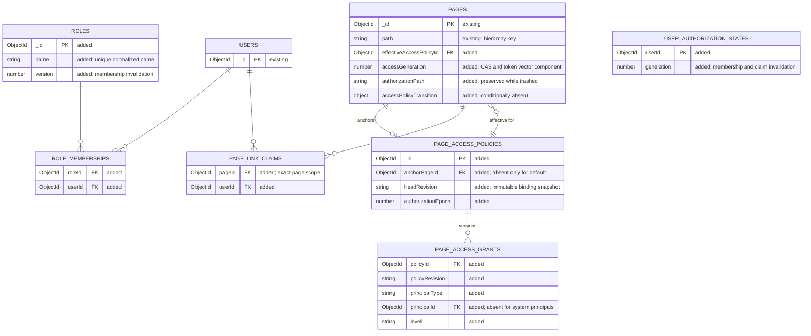
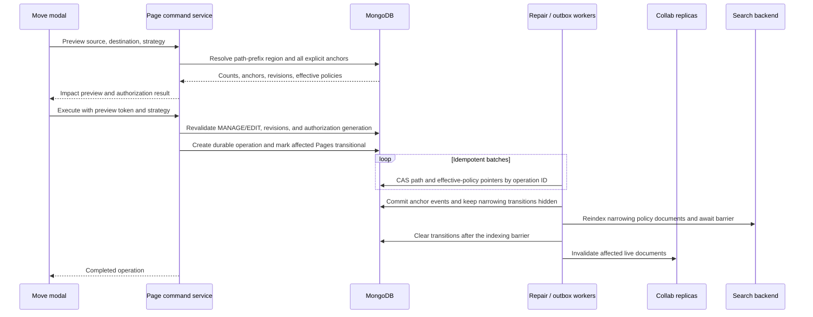

# RFC-0026: Page role-based access control and hierarchical permission inheritance

- **Status**: Draft
- **Created**: 2026-09-18
- **Related**:
  - RFC-0010 (OAuth 2.0 Provider and Personal Access Tokens) — establishes credential scopes as a capability ceiling independent of page authorization.
  - RFC-0014 (Authentication Provider Plugin Architecture) — establishes portable relation-shaped persistence as a design preference.
  - RFC-0021 (Page Metadata Change History) — establishes page metadata events, durable path operations, compare-and-set updates, and repair semantics reused here.
  - RFC-0025 (Crowi API Structured Logging and Request Correlation) — establishes the redacted operational diagnostics used during migration and repair.

## §0 Summary

Crowi will replace its binary page-grant model with an ordinal page-permission model whose visible levels are `READ`, `COMMENT`, `EDIT`, and `MANAGE`. Roles and users are the assignable principals. A person may belong to multiple roles, permission levels are assigned on each page-policy binding rather than stored globally on a role, and an exact user binding overrides the result of all matching role bindings, including with an explicit `none` value.

Each explicit access policy is attached to one anchor Page. Every Page stores a materialized pointer to its effective policy: its own explicit policy when one exists, otherwise the nearest explicit policy on a path ancestor, otherwise the singleton default policy. The default policy grants `MANAGE` to every authenticated user, preserving Crowi's open-by-default posture. An explicit child policy is a complete replacement, not an additive patch, so it can narrow or widen access and can remove the creator's access.

Policies, roles, memberships, and link claims are normalized records. A policy's complete binding snapshot is immutable and selected through a compare-and-set head revision, so changing bindings is atomic to readers without copying effective users or roles to every descendant. The materialized Page pointer keeps point reads, exact list/count queries, and search filtering non-recursive. Pointer changes caused by a new intermediate anchor, override removal, or a subtree move use a durable, resumable, fail-closed operation compatible with RFC-0021; multi-document transactions are not required.

The API is the semantic authority. It resolves the current identity, role memberships, exact-page link claims, credential kind, scopes, and authorization generation into a typed access context. The same service produces point decisions and bulk query filters. Search plugins receive a backend-neutral filter containing allowed effective-policy IDs and the required level, plus exact Page IDs admitted by page-scoped link claims; they no longer reproduce legacy grant constants or special-case administrators. API hydration remains the final authorization check.

Existing administrators do not gain a page-content bypass. Role and membership management remains behind the existing browser-session administrator boundary, and a separate administrator-only recovery command may repair access-policy metadata without reading page content. This allows an explicit policy to have no `MANAGE` principal without making the workspace irrecoverable.

## §1 Motivation and current-state enforcement inventory

The current model persists only a numeric `grant` and a `grantedUsers` array on Page (`packages/api/src/models/page.ts:849-857`). It has no action levels. The in-memory decision is exactly public page, creator, or membership in `grantedUsers` (`packages/api/src/models/page.ts:984-998`), and point reads use that decision through `findPageByIdAndGrantedUser` (`packages/api/src/models/page.ts:1279-1302`). Consequently, a granted person does not have read-only access: the same admission is reused by mutation routes.

`PUT /pages/grant` demonstrates the current effective privilege. It loads the Page through `findPageByIdAndGrantedUser` and then changes the grant (`packages/api/src/hono/handlers/page.ts:1056-1075`). A public-page viewer, the creator, or any member of `grantedUsers` can therefore reach grant mutation when the normal API credential scope also permits it. Legacy PUBLIC and SPECIFIED access are full page-management access in practice, not read-only modes. The only intentionally breaking legacy mapping in this RFC is that a RESTRICTED link claimant receives `EDIT` rather than that full management capability.

The binary predicate is copied across list, sidebar, autocomplete, backlink, history, attachment, notification, realtime, and search paths. The Mongo search plugin duplicates all four numeric grant constants and omits its grant constraint for administrators (`packages/plugin-search-mongo/src/query-builder.ts:29-36`, `packages/plugin-search-mongo/src/query-builder.ts:85-105`). Elasticsearch and OpenSearch do the same (`packages/plugin-search-elasticsearch/src/query-builder.ts:27-34`, `packages/plugin-search-elasticsearch/src/query-builder.ts:129-151`; `packages/plugin-search-opensearch/src/query-builder.ts:34-41`, `packages/plugin-search-opensearch/src/query-builder.ts:136-159`).

The installed channel-unfurl integration directly loads a Page with its populated Revision and emits a payload derived from the Page path and revision body (`packages/plugin-slack/src/events.ts:117-149`, `packages/plugin-slack/src/events.ts:153-188`). It is therefore a protected Page-content egress path, not merely a transport concern.

Notification selection currently derives watcher recipients and mention targets without a Page `READ` decision before creating delivery work (`packages/api/src/models/activity.ts:185-207`, `packages/api/src/models/activity.ts:233-300`). Response-time filtering alone cannot retract an email or integration message already sent to an unauthorized recipient.

The current plugin-facing search contract gives `SearchableDoc` no policy-generation fields and requires a numeric driver total (`packages/plugin-api/src/registries/search.ts:6-19`, `packages/plugin-api/src/registries/search.ts:87-97`). That contract must change with the authorization semantics rather than relying on undocumented driver behavior.

That administrator search behavior disagrees with the API. `isGrantedFor` has no administrator branch, and final search hydration re-applies the API's Page filter (`packages/api/src/hono/handlers/search.ts:31-50`, `packages/api/src/hono/handlers/search.ts:140-183`). The result can expose inconsistent totals or backend-dependent behavior even where final content hydration drops a hit. This RFC resolves the inconsistency in favor of the API rule: administrators receive no implicit page-content access, and all three shipped search plugins remove their administrator bypass.

The hierarchy is represented only by Page path strings. Page's schema has a unique indexed `path` and no parent reference (`packages/api/src/models/page.ts:849-857`). Existing subtree queries already use escaped path-prefix matching (`packages/api/src/models/page.ts:1714-1734`, `packages/api/src/models/page.ts:1790-1805`). A valid descendant can therefore exist without a Page at every intermediate path, and access inheritance cannot depend on walking stored parent objects.

The current collaboration boundary also needs explicit replacement. A five-minute WebSocket token is authorized when issued (`packages/api/src/util/ws-token.ts:13-20`, `packages/api/src/hono/handlers/page-collab.ts:60-118`), while `onAuthenticate` deliberately rechecks existence, lifecycle epoch, draft ownership, and editor capacity but not the complete page grant (`packages/collab/src/hooks/on-authenticate.ts:86-136`, `packages/collab/src/hooks/on-authenticate.ts:171-224`). An access revocation must therefore affect token issuance, stale reconnects, already-connected writers, and durable saves rather than waiting for token expiry.

The following surfaces are one authorization system, not independent migrations:

| Surface | Required RBAC behavior |
| --- | --- |
| Point reads and shared loaders | Use one load-and-authorize service with an explicit required level and preserve not-found-style existence hiding. |
| Lists, subpages, portal/sidebar counts, and autocomplete | Apply the same access-context predicate before pagination, grouping, or counting. |
| Search | Filter in the backend using the API-resolved authorization filter, then rehydrate and authorize again before returning paths, titles, snippets, totals, or counts. |
| Backlinks, revisions, history, artifacts, bookmarks, and attachment streams | Require `READ` for both the requested Page and every related Page that could reveal content or existence. |
| Comments and attachments | Distinguish read, comment, edit, ownership, and management operations through the action matrix in §3. |
| Notifications | Authorize every recipient at fanout/selection time for every delivery channel, then reauthorize or safely redact each Page target at API response time so neither outbound delivery nor stored notifications survive revocation as an existence leak. |
| Page-content egress integrations | Resolve authorization through the same service for the identity the integration acts for before loading or sending content. Suppress any channel unfurl or notification whose audience cannot be authorized per recipient, or reduce it to a non-identifying reference. |
| Presence and realtime collaboration | Issue read-only or editable capability from the current access state, reject stale epochs, and invalidate connected writers on revocation. |
| Page writes and lifecycle commands | Enforce the minimum level in the shared service/command boundary, not only in a handler or UI control. |

## §2 Goals and non-goals

### §2.1 Goals

- Represent reusable roles and many-to-many role membership without embedding an unbounded member list in User or Role.
- Let one user hold multiple roles and let a policy bind both roles and individual users to an ordinal page permission.
- Make a local policy a complete scope-level replacement of inherited access, with an exact user binding taking precedence over role composition.
- Preserve Crowi's open-by-default behavior through an authenticated-everyone `MANAGE` default policy.
- Resolve the nearest explicit ancestor policy by path prefix even when intermediate ancestor Pages do not exist.
- Keep point reads, exact pagination/counts, search, streams, notifications, and realtime collaboration consistent under one authorization service.
- Make revocation effective without waiting for access-token or WebSocket-token expiry.
- Support standalone MongoDB with resumable, idempotent, fail-closed multi-document operations and provide a straightforward relational representation.
- Preserve the current web-session-only, atomic, rate-limited RESTRICTED link-claim boundary while limiting each claim to its exact Page.
- Record minimal access-policy history at explicit anchors without placing principal identifiers or link secrets in ordinary Page history.
- Preserve an administrator recovery path without introducing an administrator page-content bypass.
- Give account-lifecycle user-page commands a narrow internal system identity without granting that identity general Page access.

### §2.2 Non-goals

- Server-wide capabilities, role-based administration, or replacement of the existing `user.admin` flag.
- Independent capability bits or deny algebra outside the single ordinal permission ladder.
- Anonymous page or share-link access: the adopted OQ-6 decision is authenticated users only.
- Embedding roles, policy identifiers, claims, or access controls in Markdown or rendered HTML. Untrusted Page HTML is not a trusted application-chrome surface.
- Restoring access policy by restoring a content Revision.
- Mobile role or policy management in the first implementation.
- A page-content break-glass reader for administrators.
- A general external authorization service or a database-specific recursive authorization query.

## §3 Terminology and permission/action matrix

`PagePermissionLevel` is the only page capability scale:

```ts
type PagePermissionLevel = 'none' | 'read' | 'comment' | 'edit' | 'manage';
```

The order is `none < read < comment < edit < manage`. A higher level satisfies every lower-level check. `none` is not displayed as a normal grant level; it exists so an individual user binding can override role and system-principal access with no access. Removing a role binding means that role does not participate; it does not create a deny.

An **anchor Page** owns an explicit `PageAccessPolicy`. An **inheriting Page** has no local policy and points to the nearest anchor policy. The **effective policy pointer** is the materialized Page reference used for authorization and indexing. A **binding** assigns one level to one role, one user, or one system principal within one complete policy snapshot. The system principals are authenticated `everyone` and exact-Page `linkClaimant`; neither is an administrator-editable Role.

An **access context** is a server-created snapshot containing the authenticated user ID, current role IDs and their versions, credential kind and scopes, the complete current `(page, actor)` access vector, and validated exact-Page claims. Clients and plugins cannot submit a trusted access context or a trusted authorization boolean.

| Operation | Minimum page level | Additional boundary |
| --- | --- | --- |
| Read a body; appear in list/search/autocomplete/sidebar; read backlinks, revisions, history, attachment bytes, artifacts, bookmarks, presence, or notification targets | `READ` | The credential must also satisfy its normal read scope. Related Pages are independently checked. |
| Mark seen/unseen; like/unlike; watch/unwatch; bookmark/unbookmark | `READ` | The resulting user-local record confers no Page access and is hidden or ignored after access is lost. |
| List comments | `READ` | No comment ownership is implied. |
| Create a comment; edit or delete one's own comment | `COMMENT` | Existing ownership and timing rules continue to apply. |
| Edit or delete another person's comment | `MANAGE` | Existing ownership and timing rules continue to apply; no lesser level overrides them. |
| Edit body; restore a content Revision; write realtime content; upload, replace, or delete page attachments | `EDIT` | The credential must also satisfy its normal write scope. |
| Create a child Page | `EDIT` on the canonical nearest-prefix parent scope | Creation uses the §4 creation fence and initial pointer resolver. Installing an explicit local policy in the same command additionally requires `MANAGE` on that resolved parent scope; otherwise the Page inherits and policy installation is a separate `MANAGE` command. |
| Change policy or link-holder level; rename/move; trash/delete/restore a Page; delete another person's comment | `MANAGE` | Policy commands use the current §5 access vector and compare-and-set revision. |
| Move into a destination hierarchy | `MANAGE` on the moved root and every flattened policy anchor; `EDIT` on the destination parent | All checks pass before any visible change, or the command is rejected without partial application. |
| Define/delete roles or change role membership | Existing server administrator | Browser web session only; this does not grant page-content access. |
| Repair an inaccessible or zero-manager policy | Existing server administrator | Browser web session, policy metadata only, explicit audit event; no page body or revision is returned. |

OAuth/PAT scope and page permission are intersected. For example, `pages:write` cannot edit a Page below `EDIT`, and `MANAGE` cannot compensate for a token that lacks `pages:write`. The attachment cookie fallback remains only a transport authentication path; the Page still requires the corresponding level.

For creation or a move destination, the **resolved parent scope** is the longest existing segment-prefix anchor of the parent path, or the singleton default policy when none exists. It does not require a Page document at the immediate parent path.

## §4 Policy resolution, inheritance, and precedence

Policy selection and principal evaluation are separate steps. Policy selection chooses exactly one effective policy. Principal evaluation computes exactly one level inside that policy.

For a live Page at authorization path `P`, the effective policy is selected in this order. This resolver constructs, repairs, and validates the materialized pointer; an ordinary authorization read evaluates the stored pointer plus the §5 access vector and does not re-resolve from a display path. A trashed Page is the lifecycle exception defined in §8: its `/trash/...` display path is never passed to this resolver.

1. Use the Page's local explicit policy when present.
2. Otherwise find existing live anchor Pages whose canonical authorization paths are segment-boundary prefixes of `P`, and choose the longest matching path.
3. Otherwise use the singleton default policy.

Prefix matching is segment-aware: `/a/b` is an ancestor of `/a/b/c` but not `/a/bc`. An intermediate Page is not required. The canonical resolver queries the longest live anchor authorization path among `P`, its segment-boundary prefixes, and the default policy; it never walks stored parents. If `/a/b/c` currently inherits from `/a` because `/a/b` does not exist, and a Page later exists at `/a/b` and receives an explicit policy, the durable anchor-install command repoints the `/a/b` prefix region through the next nested-anchor boundaries. Existing portal-style trailing-slash paths remain distinct stored Pages; longest segment-valid stored path wins deterministically.

Creation is a fenced hierarchy operation, not a bare Page insert. The command first resolves authorization, the initial effective pointer, and the durable fence set for every matching prefix. Creating a child requires `EDIT` on that resolved parent scope; installing an explicit local policy in the same fenced command additionally requires `MANAGE` on the resolved parent scope. Without that additional authority, creation inherits the resolved pointer and a separate `MANAGE`-authorized command must install any later policy.

Hierarchy-region operations acquire the §5 fenced holder lease for their region before scanning. Creation uses only path uniqueness for its insert, stores the resolved pointer, a new Page access generation, and the observed fence set, and then validates that fence set; it does not claim a cross-document conditional insert. If creation observes a pending or changed fence after insertion, the owning hierarchy operation must transition-mark and repoint the Page into the final topology, or reject and remove the new Page, before the operation becomes terminal. Readers exclude a transition-marked Page, and the creation path must fail closed until repair when it cannot prove that the stored pointer is no broader than the final pointer.

Anchor install/removal, move, trash, restore, and hard-delete establish their pending fence before scanning and re-scan until every Page in the region is covered by the operation marker. A creator that sees a pending or changed fence retries after terminal completion. No Page may end outside the final pointer topology, and no reader may observe a broader allow during insertion or repair.

A local policy completely replaces the ancestor policy. No role, user, `everyone`, or link binding is merged across policy scopes. Removing the local policy restores the closest remaining ancestor policy by repointing the same region.

Within the selected policy, evaluation is deterministic:

1. Collect the `everyone` level, the exact-Page `linkClaimant` level when the actor has a valid claim for this Page, and every binding for a Role the actor currently holds.
2. Take the highest collected level, or `none` when there is no match.
3. If an exact user binding exists, replace the result with that binding's level, including explicit `none`.
4. Apply credential scope as an independent ceiling at the action boundary.

The exact-user replacement occurs after link-claim evaluation. Consequently, an exact user `none` overrides a valid exact-Page link claim as well as `everyone` and all matching Roles.

The creator field is metadata only and never participates in this evaluation. The administrator flag is also absent from this evaluation. A creator or administrator who does not match the effective policy cannot read the Page.

The default policy contains `everyone: manage`. A Page with no explicit policy therefore remains fully open to authenticated users. An explicit policy may have only lower-level bindings or user `none` bindings and may consequently have no manager. An empty explicit binding set is invalid because “no configured page permission” canonicalizes to inheritance/default-open behavior rather than an accidental sealed Page.

Legacy migration materializes a local anchor whenever the Page's legacy semantics differ from its nearest already-migrated ancestor. A legacy PUBLIC Page may point directly to the singleton default policy only when that nearest migrated scope is already equivalent to `everyone: manage`; otherwise it becomes an explicit `everyone: manage` anchor so migration does not accidentally narrow it.

Binding-level permission is selected because a reusable Role should identify a group, while the required authority is local to a policy scope. A role-global level would let one administrator edit silently change every Page that mentions the Role and would make local access review misleading. Because the source requirement can also be read as role-global permission management, §19 keeps confirmation of this choice as the highest-priority open question.

## §5 Data model, indexes, limits, and relational portability

The logical model consists of `Role`, `RoleMembership`, `PageAccessPolicy`, immutable `PageAccessGrant` snapshots, `PageLinkClaim`, and an actor authorization state. Page gains an effective-policy reference, access generation, stable authorization path, and a temporary transition marker. Role identities and memberships are normalized; role IDs are never embedded in JWTs.



Immutable, revisioned binding rows make a policy replacement atomic to readers: a command writes and validates the complete new snapshot, then changes only `PageAccessPolicy.headRevision` through a CAS against the observed head. A losing writer leaves an unreachable snapshot eligible for garbage collection; it cannot expose a partial binding set. This shape preserves normalized relations without requiring a multi-document transaction to switch a policy's visible contents.

`RoleMembership` has a unique `(roleId, userId)` index and reverse indexes for membership listing and invalidation. `PageAccessPolicy.anchorPageId` has a partial unique index, with one separately identified default policy. `PageAccessGrant` has a unique `(policyId, policyRevision, principalType, principalId)` identity using a normalized sentinel or partial-index strategy for system principals. `PageLinkClaim` has a unique `(pageId, userId)` index plus a user-first index for access-context resolution. `UserAuthorizationState` has one row per user. Page has an index on `effectiveAccessPolicyId` composed with the status fields used by protected list queries, and a unique/conditional region-fence index supports creation and hierarchy operations.

`AuthorizationAuditEvent` is a durable append-only entity for administrator-only Role, membership, and recovery actions. It is readable only through browser-session administrator contracts, defaults to indefinite retention, and may be deleted only by an explicitly configured administrator retention job whose policy is itself audited.

The authoritative access version for `(page, actor)` is the serializable vector `{ pageId, pageAccessGeneration, effectivePolicyId, policyAuthorizationEpoch, actorId, actorAuthorizationGeneration }`. `pageAccessGeneration` is stored on the Page and CASed with its pointer/status/authorization-path changes; `policyAuthorizationEpoch` is stored on the selected policy head; `actorAuthorizationGeneration` is stored in `UserAuthorizationState`.

Every access-component and hierarchy-region lease has an owner identity, an expiry, renewal while held, and a fresh opaque fencing token on every claim or expired-lease reclamation. A holder must renew before expiry, and every state-changing CAS or terminal commit predicate must match the lease token that is current in durable storage. An expired lease may be reclaimed with a fresh token, so a crashed reader does not leak a slot and a slow former holder cannot release, commit, or finalize after reclamation. The pending-auth-registration flow already demonstrates fresh-token reclamation and fenced finalization (`packages/api/src/models/pending-auth-registration.ts`, `packages/api/src/services/auth-registration.ts`); authorization and hierarchy leases require an equivalent protocol.

The durable region-fence record stores the covered canonical path prefix, operation ID, owner identity, current lease token, expiry, and pending/terminal state. Losing renewal immediately removes the holder's authority to mutate the region, even if its process continues running.

A resolver acquires ready read-lease claims in canonical Page/policy/actor order, reads the Page, policy head, claim, and membership state, verifies the vector, renews while active, and holds the claims through its Page CAS. A revoker changes every affected component from ready to pending only when no unexpired reader claim remains; readers encountering pending fail closed. It performs the normalized mutation, increments the appropriate generation(s), publishes invalidation, and returns the components to ready under the current fencing tokens. Policy head changes advance the policy epoch; pointer/lifecycle changes advance every affected Page generation under its CAS; membership changes advance every affected user's actor generation; claim changes advance both the claimant actor generation and the Page generation. The same vector is carried by capabilities. Thus an authorization decision cannot combine an old pointer, policy, membership, claim, or user override with a new component, and a reclaimed holder cannot race a durable write past revocation.

Role deletion is rejected while any reachable policy snapshot references it, unless an explicit durable rewrite supplies the replacement/removal semantics. Silent deletion is prohibited. Unreachable policy snapshots and policies flattened by a completed move are garbage-collected only after durable reference checks; they are never synchronously deleted in the command's correctness path.

The implementation specs must set numeric caps for roles per user, grants per policy, total roles, access-policy IDs admitted into one query, and exact-claim Page IDs admitted into one query. Writes beyond those caps are rejected. A reader that exceeds an inline filter cap must use the specified chunked or server-side lookup strategy or return a controlled error; it must never omit authorization clauses or run an unfiltered query.

The relational representation is direct: roles, memberships, policies, versioned grants, and claims become tables; Page stores a foreign key to policy; the policy head selects one immutable grant version. No semantic rule depends on Mongo `$graphLookup`, document embedding, or recursive row-level-security behavior.

## §6 Query/read-path enforcement, search contract, and existence hiding

`PageAuthorizationService` is the sole semantic evaluator. It builds an `AccessContext`, resolves policy IDs that admit the actor at a required level after user overrides, resolves exact Page IDs admitted by valid link claims, emits a Page query predicate, and evaluates a hydrated Page using the same inputs. Existing callers such as `loadGrantedPage` remain shared boundaries but accept a required action/level instead of invoking a binary Page method.

For ordinary role/user/everyone authorization, the Page predicate filters `effectiveAccessPolicyId` by the allowed policy-ID set. Exact-page link claims are an intentional exception because their effect does not extend to descendants that share the same policy pointer; only claims admitted after evaluating the selected policy's exact-user override contribute exact Page IDs in a second bounded clause. An exact user `none` therefore removes that Page from the claim clause instead of allowing the claim to re-admit it. Both clauses also require the absence of an access-policy transition and preserve status/draft predicates. This exception is part of the typed filter rather than hidden plugin logic.

All list and count operations use the same predicate and access-context snapshot. Post-filtering is not an acceptable primary strategy because it produces wrong totals and page sizes. Backlinks authorize the target and batch-authorize all sources. Revision/history/attachment/artifact streams authorize from a minimal Page projection before loading or sending protected bytes.

Notification selection authorizes each intended recipient for `READ` before creating any in-app, email, or integration delivery. API serialization reauthorizes each Page target or emits a non-identifying tombstone; response-time checking is a second boundary, not a substitute for fanout-time authorization.

Any plugin, job, or integration that egresses Page title, path, body, revision, attachment, or derived content must resolve `READ` through `PageAuthorizationService` for the identity it acts for before loading or sending the payload. If a channel unfurl or notification audience cannot be authorized per recipient, the integration must suppress it or emit only a non-identifying reference that reveals neither Page existence nor content.

The plugin contract replaces viewer identity and legacy grants with a backend-neutral value:

```ts
type SearchAuthorizationFilter = {
  requiredLevel: 'read' | 'comment' | 'edit' | 'manage';
  allowedEffectivePolicyIds: string[];
  allowedPageIds: string[]; // Exact-page claim exception only.
};
```

The plugin-facing `SearchableDoc` type gains required `effectiveAccessPolicyId` and `pageAccessGeneration` fields; the direct-database driver reads the same Page fields. The API computes the filter and passes it to every shipped or third-party driver. Plugins do not receive `isAdmin`, role memberships, user overrides, link secrets, or legacy grant numbers, and do not interpret permission precedence.

The driver result contract may expose an exact authorization-filtered `authorizedTotal`; it must never label a raw backend total as authorized. A driver may omit the total, in which case the API either computes an exact authorized total through exhaustive continuation and hydration or omits the total from its response. A driver that cannot honor the authorization filter and this total protocol is non-conforming and must fail closed.

API hydration remains the final authority. Every returned hit is reloaded through `PageAuthorizationService` at `READ` before path, title, snippet, or related metadata is serialized. When a driver supplies `authorizedTotal`, the API subtracts every dropped candidate and obtains more candidates until the requested authorized page is full; a raw driver total is never returned. A pointer change that narrows access writes the narrower search document before committing the visible Page-pointer CAS; failure leaves the Page transitional and hidden. A widening pointer change may commit before the index write and causes only false negatives until repair. This ordering, plus mandatory hydration and dropped-hit subtraction as a corruption/lag floor, prevents an old wider index document from disclosing content or existence.

Authorization denial preserves the existing existence-hiding outcome for protected Pages, drafts, transitional Pages, paths, titles, snippets, list counts, autocomplete, backlinks, histories, notifications, presence, and byte streams. Error-contract work may type those outcomes, but must not distinguish “exists but denied” from the corresponding hidden state.

## §7 Mutation authorization and durable policy commands

Every mutation reauthorizes in the service/command layer immediately before its committing CAS. The command carries the complete §5 `(page, actor)` access vector and holds its §5 leases. Its commit predicate matches the Page generation/pointer, policy head epoch, actor generation, held ready lease identities, and a stable non-pending region fence. A mismatch caused by a concurrent policy edit, role-membership change, user override, link-claim removal, pointer repoint, or lifecycle command returns a conflict and performs no user-visible mutation.

Account registration and username lifecycle may create or rename only the canonical `/user/<username>` Page through a service-issued `userPageLifecycle` system context. This context is not a Role or policy binding, cannot read Page content or mutate any other path, is valid only while the corresponding account-lifecycle CAS is current, and must use the same fenced creation/rename and fail-closed pointer protocol as a human command.

Each such command records the account-lifecycle operation ID and `userPageLifecycle` actor kind in its durable operation and history metadata, without fabricating a human actor.

Policy binding replacement stages a complete immutable grant snapshot, validates invariants and limits, then CASes the policy head from the observed revision to the new revision while advancing `authorizationEpoch` and recording a durable pending history/invalidation obligation. The actor must still have `MANAGE` under the compared state. Best-effort “write grants, then update policy” sequences are prohibited.

Membership changes and role deletion use a durable authorization operation with an actor-generation fence. It first records the pending user/role set, advances each affected `UserAuthorizationState.generation`, and makes resolver reads for that state fail closed until membership/index mutation and invalidation are complete. Completion makes the new membership set and terminal generation visible together; interrupted operations resume idempotently. This is the required normalized-membership protocol on standalone MongoDB, not a later implementation choice.

Pointer-changing commands create a prefix-region fence with an opaque operation ID, explicit source pointer/epoch expectations, and a transition marker on every affected Page. Readers exclude transition-marked Pages. Each batch CAS matches the operation ID, expected old pointer, expected path/version, and Page access generation, then increments that generation. Retrying the same batch is idempotent, while an unrelated writer cannot satisfy the filter accidentally. The operation re-scans behind its fence before terminal completion. Search indexing that narrows access precedes clearing visibility/committing the pointer as required by §6; Page history emission, collaboration invalidation, and orphan cleanup are durable obligations derived from committed state.

An operation never broadens access as an error fallback. Missing policy rows, corrupt pointers, stale generations, incomplete snapshots, transition markers, repair uncertainty, or an oversized authorization filter all fail closed. Repair may restore the intended policy topology; it may not substitute the default open policy merely to make a Page readable.

Zero-manager policies are permitted after an explicit destructive confirmation that names the recovery consequence. The creator receives no implicit rescue grant. The administrator recovery command in §9 is therefore a required invariant, not an optional operational convenience.

## §8 Hierarchy override and move/rename semantics

Installing an explicit policy at an existing Page repoints the prefix region that currently inherits through that Page, stopping at nested explicit anchors. Removing it repoints the same region to the nearest remaining ancestor policy. A grant edit changes only the policy head/epoch and does not rewrite descendant Page pointers.

A move whose effective destination policy differs presents exactly two choices:

- **Adopt destination**: remove every explicit policy anchor inside the moved subtree and point every moved Page to the destination's effective policy.
- **Keep original**: retain or snapshot the moved root's pre-move effective policy as an explicit policy at the new root, remove every other explicit policy anchor inside the moved subtree, and point every moved Page to that root policy.

Both choices intentionally flatten descendant local policies. The modal shows the affected Page count and affected local-policy-anchor count, explains that descendant-specific assignments will be removed, and requires `MANAGE` on the moved root and every affected anchor plus `EDIT` on the destination parent. Failure of any authorization or concurrency check rejects the whole operation before visible path or policy changes. A rename that leaves the effective parent scope unchanged does not show a meaningless policy choice, but still uses the durable path protocol.

When the immediate destination parent has no Page document, `EDIT` is evaluated against the canonical resolved parent scope defined in §3 and selected by §4's longest-prefix resolver. The absence of that intermediate Page neither grants access nor makes the move impossible by itself.



The preview token is bound to the source path, destination path, selected strategy, affected anchor IDs, their policy revisions, the Page/path revisions, and the authorization generation. This binding is load-bearing: without it, the confirmation could describe one subtree while the command flattens policies created or changed after preview. A crash after transitions are marked leaves affected Pages hidden and the operation resumable; it never falls back to either policy strategy or exposes a mixed subtree.

A single-page rename, the default API behavior, moves only the selected Page. Unmoved descendants keep their paths and local policies; if the selected Page was their anchor, they are repointed to the nearest remaining source-side ancestor, while only the moved Page applies the destination choice above. A subtree rename moves the complete selected source region and applies the chosen flattening strategy to that region.

When a new intermediate Page later receives a policy, the same prefix-region operation handles descendants even if that intermediate path did not exist when they were created. Ancestor resolution and repointing always use canonical path-segment prefix matching, not parent references.

Trash is a lifecycle operation with its own durable path/pointer protocol. Trashing a non-anchor preserves its effective pointer and `authorizationPath` while changing its display path to `/trash/...`; `/trash` is never an authorization ancestor and a deleted Page remains protected by the policy it had immediately before trash. Trashing an anchor first fences and transition-marks its live descendants, repoints them to the nearest remaining live ancestor policy, then moves the anchor to trash while retaining its policy for the deleted Page. Restore reverses that sequence under a region fence: it restores the original authorization path and status only after revalidating the retained vector and collision state, then restores/repoints live descendants if the Page is again an anchor. Hard delete is forbidden until all live descendants and redirect stubs have been durably repointed and no Page pointer references its policy; policy GC follows only after that proof. The redirect stub created at the former path is never an anchor, receives the original protected effective pointer, and authorizes both the stub and redirect target before revealing either. Delete, restore, and hard-delete use the same `MANAGE`, vector-CAS, transition, search, and collaboration invalidation rules as a scope-changing rename; the internal `/trash` rename is not exempt.

## §9 Role/membership administration and policy recovery

Administrators create, rename, order, describe, and delete Roles and manage memberships through typed `/admin` contracts protected by `createJwtAdminRequired`. That middleware already requires both a web-session auth context and `user.admin === true`; an administrator's PAT or OAuth token is rejected (`packages/api/src/hono/middleware/admin.ts:38-59`). The same boundary is retained.

A Role has identity and presentation metadata but no server-administrator bit and no global page-permission level. Administration UI shows member count and policy usage, including the binding level at each usage, so the impact of a role edit or deletion is reviewable. Membership revocation advances its authorization generation and invalidates affected active collaboration connections; it does not wait for JWT expiry.

Administrators do not bypass Page authorization in normal page, search, stream, notification, history, or collaboration paths. The shipped search plugins' current `isAdmin` bypass branches are removed, and the plugin contract no longer carries that field.

Recovery is a narrow exception for policy metadata, not content. An administrator-only web-session inventory lists opaque Page IDs whose policies have no manager or whose pointers are missing, corrupt, or unreachable, together with only status and policy-topology health; it exposes no path, title, body, or content-derived field. The recovery command accepts one of those IDs, inspects only the minimum policy topology/revision summary, and performs one of two audited repairs: add a selected user or Role as `MANAGE`, or replace a corrupt/unreachable pointer with a selected valid ancestor/default policy after explicit confirmation.

Recovery returns no body, revision content, attachment metadata, search snippet, or ordinary Page history payload. It advances the policy authorization epoch, appends an `AuthorizationAuditEvent`, creates the minimal anchor history event permitted by §11, and triggers the same realtime/search invalidation as an ordinary policy command.

This recovery path makes zero-manager and creator lockout states recoverable without defining `user.admin` as a content reader. If the path itself cannot prove a target policy topology, it fails closed and requires the durable repair worker to establish that topology before a grant is added.

## §10 RESTRICTED link-claim compatibility

The existing ID-link flow becomes a persistent `PageLinkClaim(pageId, userId)` relation. A successful claim is authenticated, bound to the exact Page ID, and evaluated only when that Page's effective policy contains the `linkClaimant` system binding. The default link-holder level is `EDIT`. A manager may change or remove that system binding through the page policy UI. Every migrated RESTRICTED policy explicitly contains `linkClaimant: EDIT`, so its migrated claims are effective; a claim has no independent permission level.

Claim creation preserves every current boundary: it is available only to browser web sessions, PAT/OAuth credentials are rejected before rate-limit accounting, the per-user rate limit remains, and one atomic eligibility write proves that the Page is still published, still link-enabled, and not already claimed. The current code's corresponding single conditional write is at `packages/api/src/models/page.ts:1369-1424`.

A claim never grants an inherited hierarchy. Even when a descendant shares the anchor's effective policy pointer, the claim matches only its stored `pageId`; this is why query and search filters carry exact claim Page IDs separately from allowed policy IDs. A descendant requires its own link flow and claim.

Removing a claim, disabling the link binding, lowering its level, or replacing the Page policy advances authorization state and revokes new token issuance immediately. Existing collaboration connections for that user/Page are invalidated under §12. Raw link material and claim identities never appear in search documents, structured logs, ordinary Page history, notification payloads, or Markdown.

The legacy schema does not record whether a RESTRICTED `grantedUsers` member arrived through a link claim or another path, so claimant provenance cannot be recovered. Migration therefore gives the creator an exact `MANAGE` binding and converts every other existing member into an exact-Page claim at `EDIT`; this ambiguity rule is the single accepted legacy permission downgrade. Those members currently pass the same full-access predicate as every other granted user, but after migration they cannot change policy, move, or delete unless another binding gives `MANAGE`.

## §11 RFC-0021 history integration and audit separation

Access policy is Page metadata, not revision content. Restoring a content Revision never restores policy, membership, link claim, or an effective-policy pointer. Reversing a policy change is a new authorized command that produces a new event.

Each explicit anchor whose policy or anchor status changes receives one typed `access_policy_changed` Page history event through RFC-0021's sequence and pending-event machinery. Its payload may include inherited-versus-explicit mode, prior/new non-sensitive level summary, prior/new source-anchor state, move strategy, and durable operation ID. It contains no user ID, Role ID, Role name, member list, email, claim identity, or link secret.

Descendants do not receive fan-out events when an ancestor policy changes. Their UI derives and displays the current inheritance source from the effective policy anchor. A move that removes several descendant anchors records an event at each affected anchor and at the moved root as applicable, but still creates no event for pages that merely inherit a new pointer.

Role and membership changes belong to an administrator-only audit boundary because one change can affect many unrelated Pages and exposes organizational identity. They are not PageHistoryEvents. The recovery command writes both that administrator audit and the minimal anchor event, without principal identifiers in the latter.

Policy-head CAS, pointer transitions, and path moves carry their pending history obligation in the same durable state that commits the visible change. Best-effort dual writes are prohibited. An outbox worker may publish the event later, but a completed repair can prove whether the event remains pending and emit it exactly once under RFC-0021's sequence rules.

## §12 Realtime collaboration, presence, and revocation

The token endpoint requires `READ` to issue a read-only collaboration/presence token and `EDIT` to issue an editable token. Editor-cap promotion may only make a token more restrictive. The token includes the Page ID, user ID, readonly flag, existing collaboration lifecycle epoch, and the complete current §5 `(page, actor)` access vector. Its five-minute expiry remains a replay bound, not the revocation mechanism.

`onAuthenticate` must change from its current “already authorized by the API” assumption. It verifies the signature, Page identity, lifecycle epoch, every component of the §5 vector, Page existence/status, and current permission. A stale vector is rejected with the same generic permission-denied behavior as another invalid capability; the client must fetch a new token. A user who now has `READ` but not `EDIT` receives a newly minted read-only token rather than reusing an editable token.

The current update hook compares and persists only the collaboration lifecycle epoch when appending an update (`packages/collab/src/hooks/on-change.ts:87-118`). The complete authorization vector added here is therefore a required ingestion-contract change, not a property of the existing append path.

Already-connected writers are handled by the revocation command, not token expiry. Before a policy, membership, user override, link-claim, pointer, or lifecycle revocation is reported complete, the command advances the relevant durable vector component and emits an invalidation for every affected Page, or for every live connection of an affected user when membership scope is broader. Each replica tombstones and detaches the live document, broadcasts a force-reload reason that reveals no policy detail, and closes captured connections after the bounded grace period. The existing in-process invalidator already uses tombstoning, detach-before-reconnect, and forced close for content invalidation (`packages/collab/src/invalidation.ts:18-35`, `packages/collab/src/invalidation.ts:204-235`); access invalidation extends that contract across replicas.

Every durable collaboration update ingestion carries the connection's complete access vector, verifies it against the current Page/policy/actor state and the process invalidation fence, and persists that vector with the update. A missing, mismatched, or behind-fence vector is refused before the update enters the shared document or append log; ingestion may not rely only on a later save failure.

Every durable collaboration save separately reauthorizes `EDIT` and includes the current complete access vector in its Page/policy/actor CAS. Therefore a stale connected writer cannot ingest or commit after revocation even if a cross-replica invalidation message is delayed or a socket ignores force reload.

Multi-instance deployments require the existing Redis boundary for access invalidation. Policy/membership commands that can revoke live access are rejected when the invalidation subscriber is not ready; repair leaves a durable pending obligation rather than claiming success. Single-instance deployments use the same typed invalidation interface in process. Reconnect during a drain is rejected or materializes only after a fresh authorization check.

Artifact delivery is a cookie-free bearer-token surface. Its token carries the Page ID, revision ID, user ID, and the mint-time access vector, but its separate origin has no session with which to reauthorize; this RFC explicitly accepts the existing 60-second expiry as the maximum artifact replay bound after revocation. The artifact URL endpoint must still require `READ` at minting, never log the token, and test that a revoked reader cannot mint another URL.

Presence requires `READ` and is removed on loss of `READ`. Presence payloads never reveal another participant to a viewer who cannot read the Page. The implementation spec must test policy edits, user `none`, membership removal, link-claim removal, reconnect with a still-unexpired token, active-writer disconnect, multi-replica delivery, and save CAS races.

## §13 API contracts and Web/admin/page UI

The legacy visibility-only `PUT /pages/grant` contract is replaced or versioned; it cannot express principals, levels, inheritance, or policy revisions. The versioned Page create/update contracts remove `grant` from their new request shapes and reject it as an unknown access input. A compatibility version may translate legacy `grant` into the equivalent complete policy mutation, but only inside the same fenced command and subject to the §3 `MANAGE` requirement for installing or changing policy.

The current create and update request schemas both accept `grant`, and their handlers consume it alongside body input (`packages/api-contract/src/schemas/page.ts:359-374`, `packages/api/src/hono/handlers/page.ts:870-946`, `packages/api/src/hono/handlers/page.ts:973-1037`). Removing, translating, or rejecting those fields is therefore part of the contract migration, not only a replacement for `PUT /pages/grant`.

An update request that combines a body write with any translated access change is one authorization and commit unit. If the actor lacks `MANAGE`, or if either CAS fails, the entire request is rejected before committing the body or the access change; partial body-only success is prohibited.

New typed contracts expose:

- effective access summary and current inheritance source;
- creation/replacement/removal of an explicit policy with an expected revision;
- role/user/system bindings and explicit user `none`;
- link-claim enablement and holder level;
- move preview and execute with the durable preview token and selected strategy;
- administrator Role and membership CRUD; and
- administrator policy repair with an expected policy/topology revision.

Reading a compact “why can I access this Page?” summary requires `READ` and returns no other principal identities. Listing or editing policy principals requires `MANAGE`. Administrator Role/membership routes remain web-session-only. All mutation contracts return stable validation/conflict/hidden-denial errors and regenerate the committed OpenAPI JSON, YAML, and generated TypeScript artifacts.

The page settings drawer gains a permission panel showing effective level, inherited/explicit state, current anchor path, and the consequences of replacing inheritance. A `MANAGE` viewer can edit Role/user bindings, explicit user overrides, and link-holder level. The move modal presents the two §8 strategies and both impact counts before confirmation. A zero-manager confirmation links to the administrator recovery procedure without implying an administrator content bypass. Permission, recovery, and move-confirmation controls are application chrome outside the rendered Page-content tree and must remain above an isolated Page-content stacking/containment boundary. Before the `EDIT`/`MANAGE` split ships, stored raw HTML must pass a configured sanitizer that removes executable content, active forms/navigation, styles and positioning capable of UI redress, and unsafe embeds; the hostile-HTML test suite must prove that an `EDIT` author cannot hide, overlay, imitate, focus-steal from, or submit any management control viewed by a `MANAGE` user.

The Admin UI adds Role definition, membership, usage, deletion blockers, and recovery audit surfaces using existing admin navigation patterns. Role presentation does not imply server privileges. Page management is not added to mobile clients in this RFC's first rollout.

Successful policy, membership, claim, and hierarchy mutations invalidate Page detail/list/sidebar/search/history/access-summary query keys and publish the page-level live-update signal established by RFC-0021. Clients refetch authoritative summaries; they do not locally recompute role precedence from cached membership.

## §14 Legacy migration, mixed-version cutover, rollback, and repair

The backfill preserves actual current capabilities, not names historically associated with the numeric grants:

| Legacy state | New explicit/default policy |
| --- | --- |
| `grant` missing/null or PUBLIC | Point to the singleton default policy when the nearest migrated ancestor is already equivalent; otherwise create an explicit `everyone: MANAGE` anchor. |
| OWNER | Creator and every existing `grantedUsers` member at `MANAGE`. |
| SPECIFIED | Creator and every existing `grantedUsers` member at `MANAGE`. |
| RESTRICTED | Creator at `MANAGE`; `linkClaimant: EDIT`; every other existing `grantedUsers` member becomes an exact Page claim at `EDIT`; future claimants also receive `EDIT`. |

PUBLIC, OWNER, and SPECIFIED mappings preserve current full-access behavior, including reachable non-creator OWNER members. Migration materializes a local anchor whenever a Page's legacy semantics differ from its nearest migrated ancestor. The creator bypass is converted into an explicit migration binding where the legacy mode requires it, then removed from runtime evaluation. Only non-creator members of RESTRICTED pages lose management capability by default, because the legacy array cannot recover which of them were link claimants.

Migration is staged and restartable:

1. Add models, indexes, the default policy, authorization service, feature flags, repair commands, and optional new Page fields while legacy grant checks remain authoritative.
2. Backfill policies, immutable grant snapshots, exact link claims, actor authorization states, authorization paths, effective pointers, and Page access generations idempotently, including path-prefix inheritance and missing intermediate ancestors. RESTRICTED rows receive `linkClaimant: EDIT`, creator `MANAGE`, and an exact `EDIT` claim for every other existing member without asserting claimant provenance; OWNER rows preserve every existing granted user at `MANAGE`.
3. Dual-evaluate legacy and new decisions in report-only mode across point reads, bulk predicates, action levels, search, notifications, and collaboration. Logs contain IDs/count categories only as permitted by RFC-0025 and never content, paths, role names, users, or link data.
4. Freeze every legacy grant mutation, run a final delta reconciliation from legacy state into policy state, rebuild all search backends with effective policy IDs under the new backend-neutral plugin contract, and wait for the indexing barrier. The freeze remains in force until cutover or rollback.
5. Repeat reconciliation until it reports zero outstanding deltas after the indexing barrier, then drain old replicas and switch point reads, list/count filters, search, notifications, streams, mutation commands, and collaboration token issuance together. Cutover is prohibited before that zero-delta result, and a mixed fleet is forbidden because an old replica can reopen access revoked by the new model.
6. Enable policy/Role UI and durable hierarchy operations, then observe parity and repair queues while legacy grant mutation remains disabled.
7. Remove legacy fields, constants, plugin branches, and compatibility code only after no old client/server/search index depends on them.

The legacy-grant freeze is enforced at the shared command boundary for every browser, token, plugin, and background entry point. The final reconciliation records its source watermark and target policy/index generations so the zero-delta result and indexing barrier are reproducible after a crash.

Rollback before the cutover may return to legacy authority. After new policy writes are accepted, rollback to an old binary-grant replica is prohibited because it can broaden access and cannot represent user overrides or levels. Recovery after cutover rolls forward using policy/pointer repair and search rebuild.

Verification includes per-mode row counts, direct-read parity, action parity, exact list/count parity, search result/total parity in all three shipped backends, no stale RESTRICTED claims, effective migrated link claims, non-creator OWNER-member preservation, creator-bypass removal, admin no-bypass behavior, pointer-topology scans, trash/restore/redirect topology scans, orphan-snapshot accounting, and interrupted-operation resumption.

## §15 Security analysis and abuse cases

- **Central authority**: handlers, models, plugins, jobs, realtime connections, and background work call the typed service or receive its filter; none accepts a client-supplied “authorized” boolean. Page-content egress integrations authorize the acting identity before loading content and suppress audiences that cannot be authorized per recipient.
- **Scope intersection**: credential scopes and Page levels are both required. A stronger value in either dimension cannot substitute for the other.
- **Existence hiding**: denial is applied before loading related content, counting, highlighting, grouping, populating notifications, or opening streams.
- **Creator and administrator lockout**: neither identity grants content access. Zero-manager is allowed only with confirmation and a metadata-only administrator recovery command.
- **User-specific deny**: explicit user `none` overrides `everyone`, link claimant, and all matching Roles at the selected scope, preventing a high Role from accidentally defeating the intended individual override.
- **Stale identity**: Role IDs are not stored in access tokens. The §5 Page/policy/actor access vector invalidates caches, realtime tokens, active connections, and mutation CAS decisions. Cookie-free artifact bearer tokens are the explicit exception and remain replayable only within the §12 60-second bound.
- **Link abuse**: claims remain authenticated, web-session-only, rate-limited, exact-Page-scoped, and atomically eligibility-checked. Secrets and claimant identities are excluded from logs, search, history, and Markdown.
- **Search and notification leakage**: every backend filters with the API-produced contract; narrowing pointer writes are indexed before visibility, hydration and authorized-total correction are mandatory floors, and a raw total is never exposed. Notifications authorize recipients before every delivery-channel fanout and reauthorize again on API serialization.
- **Mixed replicas**: cutover is drain-first. Compatibility code cannot interpret absence of a new pointer as public after new authority is enabled.
- **Standalone Mongo failures**: transition markers and pending generations fail closed; durable operations resume by opaque operation ID; repair never defaults to broader access.
- **Confused deputy**: server-created access contexts include actor, credential kind, scope, generation, and required action. Plugins receive only the minimum backend-neutral search filter.
- **Stored-content privilege escalation and UI redress**: access metadata is never encoded in Markdown/HTML, and Markdown is not trusted application chrome. The `EDIT`/`MANAGE` split is blocked on the §13 sanitizer and isolated-content boundary because an EDIT author must not execute active markup or impersonate/manage controls in a MANAGE viewer's session.
- **Artifact replay**: the cookie-free artifact origin cannot reauthorize its bearer token. Artifact delivery therefore carries the §5 access vector at minting and explicitly accepts the existing 60-second token TTL as its maximum post-revocation replay bound; this exception is tested and documented rather than mistaken for immediate revocation.
- **Resource exhaustion**: policy/membership/filter sizes are bounded and over-limit writes fail. A size overflow never turns into post-filtering or an omitted predicate.

## §16 Performance model and operational limits

Ordinary authorization has two bounded phases: resolve the actor's current Role/user/system matches into allowed policy IDs for the required level, then use an indexed Page predicate. Point reads can evaluate the Page's one effective policy directly. Bulk list/count queries remain exact and non-recursive. A policy binding edit changes one policy head; a membership edit changes normalized membership state; neither rewrites descendant Pages.

The expensive operation is changing an inheritance boundary. Installing/removing an anchor, creating an intermediate anchor, or moving/flattening a subtree rewrites effective pointers for a path-prefix region. These are asynchronous durable commands with impact previews, progress, idempotent batches, and repair. Their cost is proportional to the affected Pages, not to every Page in the workspace.

Access-context caching is permitted only when keyed by user identity, required level, policy/membership generation, and exact-claim generation. A cache miss resolves from durable state; an unknown or mismatched generation fails closed. Cache lifetime alone is never a revocation guarantee.

The implementation specs must benchmark and fix the numerical caps introduced in §5 against Mongo and all three search drivers. When an actor legitimately matches more policies than the inline-ID cap, the supported alternative may be chunked exact queries with stable merge/count semantics or a server-side temporary/lookup representation. Returning the first chunk, approximating totals, or asking a plugin to infer principals is prohibited.

Operational metrics cover policy-resolution latency, allowed-policy cardinality, pointer-operation backlog, transition age, orphan snapshots/policies, migration mismatches, search false negatives, invalidation latency, rejected stale epochs, and administrator recovery use. Metrics and logs do not carry principal identities, paths, policy contents, or link material.

## §17 Alternatives considered

### §17.1 Materialized effective grants on every Page

Storing role/user-level keys directly on every Page gives one fast indexed query and a similarly direct search document. It is rejected as the default because a policy change rewrites an entire inheritance region, duplicates security state, and creates the most dangerous crash state: stale allow keys. A fail-closed dirty-root barrier and repair would still be required. It remains a fallback only if benchmarks show policy-ID queries cannot meet the supported limits.

### §17.2 Recursive nearest-ancestor lookup on every read

Storing only local policies and resolving the nearest ancestor at request time makes policy and move writes cheap. It is rejected because exact lists, totals, pagination, autocomplete, and search would require recursive database queries or post-filtering. Mongo and relational databases expose materially different recursion mechanisms, and post-filtering can leak snippets or return incorrect counts.

### §17.3 Closure table

A closure collection/table makes ancestor joins explicit and portable in concept. It is rejected because every move or rename maintains `O(subtree × depth)` edges and still needs careful bulk permission evaluation. The materialized effective-policy pointer stores the one ancestor relation authorization actually needs.

### §17.4 Ancestor array on Page

Persisting every ancestor path or ID on each Page avoids recursive reads but rewrites every descendant on hierarchy changes and is less natural in a relational schema. It duplicates hierarchy state without removing the need for durable subtree operations.

### §17.5 Materialized-path lookup without an effective pointer

Resolving the longest matching anchor by path prefix is retained for pointer construction and repair, but rejected as the ordinary read contract. Efficient longest-prefix queries and indexes differ by backend, while exact list/count/search authorization would still be substantially more complex.

### §17.6 External relationship authorization service

A separate service can model principals, tuples, and ancestry independently of the application database. It is rejected for the initial implementation because it adds an availability, deployment, consistency, migration, and batch-query boundary for one Page hierarchy. The local semantic model remains normalized enough to migrate later if broader resource authorization justifies that cost.

### §17.7 Role-global permission level

Storing one page level on Role is rejected because a Role reused across policies could not express local authority, and an administrator Role edit could silently change every Page. A Role remains identity plus membership; each policy binding owns its level.

### §17.8 Administrator content bypass

An implicit `MANAGE` bypass is rejected because it defeats content isolation and existence hiding and would preserve the current search-plugin inconsistency. Metadata-only repair provides recoverability without making ordinary Page reads special-case administrators.

## §18 Phased implementation plan and testable invariants

Each phase requires a reviewed implementation-ready spec. RFC-0021 must be landed before access-policy history and durable hierarchy mutations begin.

### Phase 1: role, policy, and authorization foundations

- Add Role, RoleMembership, versioned PageAccessPolicy/PageAccessGrant, PageLinkClaim, UserAuthorizationState, default policy, indexes, bounds, access-vector resolver/CAS protocol, and typed administration contracts.
- Implement `PageAuthorizationService`, access contexts, binding precedence, scope intersection, no-admin/no-creator bypass, and administrator recovery.
- Add dual evaluation without changing runtime authority.

### Phase 2: read surfaces and search contract

- Backfill policies/pointers/claims and introduce transition-aware Page predicates.
- Convert point reads, lists/counts, autocomplete, backlinks, history/revisions, streams, notifications, presence, artifacts, and related loaders.
- Amend the plugin-facing `SearchableDoc` and driver result contracts, enforce authorization-filtered or omitted totals, fail closed for non-conforming drivers, enforce narrowing-before-visible pointer indexing plus dropped-hit correction, rebuild indexes, and preserve final API hydration.

### Phase 3: mutation levels and page UI

- Enforce the §3 matrix at service/command boundaries for page, comment, attachment, Revision restore, fenced trash/restore/hard-delete, and policy operations.
- Add permission settings, effective-source display, user override, link-holder control, zero-manager confirmation, sanitizer, and isolated Page-content boundary.
- Replace/version legacy grant inputs on page grant, create, and update contracts; make combined body/access updates atomic at the command boundary; and regenerate OpenAPI artifacts.

### Phase 4: hierarchy operations and history

- Implement explicit-anchor install/removal, fenced creation with missing intermediates, move preview/execute, both flattening strategies, trash/restore/redirect lifecycle, durable repair, anchor-only history, and garbage collection.
- Test interrupted operations and concurrent creation at every durable step and ensure ordinary readers never observe a partial broad allow.

### Phase 5: realtime revocation

- Add the complete access vector and lease protocol to tokens and saves, full `onAuthenticate` reauthorization, read-only issuance, active connection invalidation, cross-replica delivery, readiness gating, and stale-update refusal.

### Phase 6: cutover and legacy removal

- Freeze legacy grant mutation, reconcile to zero outstanding deltas, pass the search indexing barrier, complete parity reports, perform a drain-first cutover, observe repair/invalidation queues, then remove legacy fields/constants and compatibility branches.

The release gates are:

- Every protected read surface returns the existing hidden outcome below `READ` and leaks no body, path, title, snippet, count contribution, byte stream, history, backlink, presence, or notification target.
- Every mutation enforces the §3 level inside the shared service/command even when entered through Web, PAT/OAuth, collaboration, plugin, or background work.
- Creating a child requires `EDIT` on the resolved parent scope, while installing an explicit policy in that same command additionally requires `MANAGE`; without `MANAGE`, creation inherits and no policy mutation is partially applied.
- Multiple Roles compose by highest level and an exact user binding then overrides that result, including `none`; membership changes take effect without JWT expiry.
- A local policy fully replaces its ancestor, may narrow or widen access, and restores nearest-ancestor inheritance when removed.
- Path-prefix inheritance works with missing intermediate Pages and repoints the correct bounded region when an intermediate anchor is later added.
- PUBLIC/null remains everyone `MANAGE` through the default or a required local anchor; OWNER creator and existing members remain `MANAGE`; SPECIFIED members remain `MANAGE`; RESTRICTED creator remains `MANAGE`, every other existing member becomes an exact-Page `EDIT` claim without inferred provenance, and the policy contains `linkClaimant: EDIT`; creator identity adds nothing after migration.
- Point reads, list items/totals, search hits and any reported authorized total, autocomplete, sidebar counts, notifications, and streams agree for the same actor and required level; no driver returns a raw total as authorized.
- Administrators receive no ordinary content bypass in API or any search backend, while metadata-only recovery can restore a zero-manager policy.
- Revoking `EDIT` through policy, membership, user override, claim, pointer, or lifecycle change blocks new editable tokens, rejects stale reconnects, invalidates active writers, refuses stale update ingestion, and prevents durable saves through complete access-vector CAS.
- Policy/pointer/move/trash/restore operations interrupted after any step resume to one final topology; concurrent creation is fenced or retried, and no error or repair path broadens access.
- Every lease expires, renews while held, is reclaimed only with a fresh fencing token, and rejects a former holder's late CAS or finalization against the current token.
- Both move choices produce exactly the modal preview, flatten all descendant local policies, and create events only at affected anchors.
- Ordinary Page history contains actor/time and non-sensitive policy summaries without principal IDs or link material; Role/membership identity stays in administrator audit.
- The design passes on standalone MongoDB and has no correctness dependency on multi-document transactions or recursive Mongo queries; search narrowing is indexed before visibility and mandatory hydration/total subtraction handles residual stale candidates.
- Hostile stored HTML cannot execute active content, alter application chrome, or redact/imitate policy, recovery, or move-confirmation UI for a higher-privileged viewer.
- Artifact delivery has no post-revocation replay beyond its explicit 60-second bearer-token bound.
- Notification and content-egress fanout authorizes every recipient before delivery, and an audience that cannot be checked per recipient receives no Page-identifying payload.

## §19 Open questions and recorded decisions

### OQ-1: Where does a Role's permission level live?

Options were (1) binding-level only, (2) Role default with policy override, and (3) Role-global only. This RFC adopts option 1 because it keeps membership reusable and makes authority local and reviewable. Confirmation remains required before approval because the originating requirement can also be read as asking administrators to manage a global permission on each Role. This is the highest-priority residual question.

### OQ-2: How do principals compose inside one policy?

Options were (1) highest matching Role/system level followed by an exact user override, (2) highest of every match so user bindings can only add, and (3) deny-wins algebra. This RFC adopts option 1, including explicit user `none`, because it preserves multi-Role composition while giving the more specific principal a deterministic override without adding cross-scope deny semantics.

### OQ-3: Does `user.admin` bypass Page policy?

Options were (1) no content bypass, (2) full `MANAGE` bypass, and (3) audited emergency read-only access. This RFC adopts option 1 to preserve content isolation and align API, search, notifications, streams, and realtime behavior. Metadata-only repair is mandatory so recoverability does not require content access.

### OQ-4: How is a link holder represented?

Options were (1) authenticated persistent claim, (2) request-scoped signed share token, and (3) an administrator-editable system Role. This RFC adopts option 1, defaults the holder to `EDIT`, and limits the claim to the exact Page. It preserves the web-session-only, atomic, rate-limited, PAT/OAuth-rejecting boundary and avoids turning a share audience into a normal Role.

### OQ-5: How much PageHistoryEvent fan-out is required?

Options were (1) anchor event only, (2) one durable event per affected descendant, and (3) anchor event plus a derived current inheritance explanation on descendants. This RFC adopts option 3. It avoids identity-sensitive event amplification while making the current source understandable; principal identities remain outside ordinary Page history.

### OQ-6: Is anonymous public/share access included?

The available options are (1) authenticated users only, (2) anonymous READ for public policy, and (3) anonymous link-holder access. This RFC adopts option 1. Public-wiki mode is not merged into this RBAC change, and link claims remain authenticated persistent relations created through the existing web-session boundary; neither is an anonymous-read feature.

### OQ-7: What does subtree move flattening mean?

Options were (1) flatten descendant local policies in both modes, (2) flatten only when adopting destination, and (3) preserve every descendant policy. This RFC adopts option 1. It makes the modal warning literal and the final topology predictable, at the cost of a destructive normalization that requires impact counts and `MANAGE` on every affected anchor.

### Implementation questions for follow-up specs

- What numerical caps and indexed execution strategy satisfy the §5 and §16 bounds for Roles, memberships, grants, allowed-policy IDs, exact claim IDs, and path-operation batch size, including when one actor matches more policies than the inline allowed-policy cap?
- What acknowledgement/readiness protocol is required before a multi-replica access revocation reports completion, while the save CAS remains the final durable-write guard?
- How are portal-style trailing-slash path twins presented in the policy UI when both are stored Pages at the same apparent hierarchy position, while the normative longest valid stored-path rule remains deterministic?
- How must a move preview token bind the complete source member set and the destination policy revision so execution cannot apply a stale preview?
