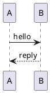

# @crowi/plugin-renderer-plantuml

PlantUML diagram renderer for Crowi 2.x. Sends `` ```plantuml ``
fenced code blocks to an operator-configured PlantUML server and
inlines the returned SVG (or PNG) into the rendered page.

## What it does

Given a fence like:

````markdown

````

The plugin:

1. Deflate+base64-encodes the diagram source via `plantuml-encoder`.
2. Fetches `${serverUrl}/${outputFormat}/${encoded}` from the
   configured server.
3. For SVG, runs the shared DOM-based sanitizer (`@crowi/svg-sanitize`,
   PlantUML's `allowSafeHref: true` policy) and wraps the result in `<div
   class="diagram-embed plantuml-embed">`.
4. For PNG, base64-encodes the body and emits an `` data URL.
5. Caches the result in Crowi's `PluginRenderCache` with a 1h fresh
   TTL (4h stale-while-revalidate window).

Network or server errors are cached as `RenderError` (`network` /
`timeout` / `not_found`) with the per-code TTL from
`packages/api/src/renderer/cache/index.ts:RENDER_ERROR_TTL`, so a
brief PlantUML outage doesn't hammer the server.

## Install

Bundled in the Crowi monorepo:

```bash
# in the Crowi monorepo (dev path):
pnpm --filter @crowi/api add -D @crowi/plugin-renderer-plantuml
# or in a standalone runner:
npm install @crowi/plugin-renderer-plantuml
```

## Configure

### Enable in `crowi.config.json`

```jsonc
{
  "plugins": [
    "@crowi/plugin-renderer-plantuml"
  ]
}
```

A server restart is required for plugin-list changes.

### Per-plugin config (admin UI)

Open `/admin/plugins → @crowi/plugin-renderer-plantuml` and set:

| Field          | Default                  | Notes                                                       |
|----------------|--------------------------|-------------------------------------------------------------|
| `serverUrl`    | `http://plantuml:8080`   | Base URL of your PlantUML server. Matches the docker-compose service hostname Crowi ships. |
| `outputFormat` | `svg`                    | `svg` (preferred) or `png` (fallback for installs whose server only serves PNG). |

### Migrating from Crowi v1 (`PLANTUML_URI` env)

v1 used the `PLANTUML_URI` environment variable to point at the
PlantUML server. v2 reads the URL from this plugin's `serverUrl`
config field instead:

1. Read your existing `PLANTUML_URI` value.
2. In `/admin/plugins → @crowi/plugin-renderer-plantuml`, paste the
   URL into `serverUrl`.
3. Save. The renderer picks up the new value on next boot (or on
   `reconfigure` once Phase 7's hot-reload lands).

The env variable is no longer consulted by the plugin.

## Cache behaviour

- Cache key: `sha256(diagramSource)`. Editing the diagram body
  invalidates the slot naturally; editing `serverUrl` / `outputFormat`
  does NOT invalidate immediately — wait for the 1h TTL to roll over
  or bump `cacheVersion` (developer-side; restart required).
- Error responses (network / 5xx / 404) are cached for 5 minutes per
  the Phase 4 error-cache table.

## SVG sanitization

SVG output is sanitized by the shared, DOM-based
[`@crowi/svg-sanitize`](../svg-sanitize) package — the same sanitizer
`@crowi/plugin-renderer-mermaid` uses,
parameterized per renderer (this plugin passes `allowSafeHref: true`,
so a benign `https:` `href` — e.g. a PlantUML `[[https://... label]]`
link — survives; `javascript:`, `data:`, and protocol-relative URLs
are always stripped regardless of policy). It drops any element not on
an explicit allowlist (`<script>`, `<foreignObject>`, `<iframe>`, SMIL
animation elements, ...), `on*=` event-handler attributes, the `style`
attribute, unsafe `href`/`url()` references, and non-essential XML
namespace declarations.

`@crowi/svg-sanitize` is a private, internal-only package: this plugin
bundles its compiled output directly into `dist` at build time (rather
than depending on it at runtime), so a sanitizer change requires
re-publishing this plugin — see `packages/svg-sanitize/README.md`.

This is defence-in-depth — the PlantUML server is operator-owned, so
the trust model is "trusted upstream" rather than "user-uploaded
content" — but the same sanitizer closes the same class of injection
either way.

## Out of scope (Phase 6)

- Mermaid (` ```mermaid `) — Phase 6.1, separate plugin.
- PlantUML PNG → SVG auto-fallback when SVG endpoint 404s — Phase 6.1.
- Per-server-host trust list / CORS / proxying — operator's network
  responsibility.

## Testing

This package's own unit tests (`src/index.test.ts`) cover the render pipeline (fetch, sanitize, cache metadata, error mapping) with a mocked `fetch`. The encoder is verified against a value PlantUML itself publishes as a text-encoding example, so a broken encoder is caught without needing a live server. This package has no integration test against a real PlantUML server — `packages/e2e` does not run one. The remaining unverified surface is PlantUML's own response format changing upstream; that is not a regression in this plugin's code and would surface in any operator's environment regardless of how this package is tested.

## See also

- RFC-0002 §"Phase 6 — bundled renderer plugins" for the design
  rationale + cache contract.
- [`plantuml-encoder`](https://www.npmjs.com/package/plantuml-encoder)
  — the upstream encoder this plugin wraps.
