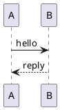

# @crowi/plugin-renderer-plantuml

PlantUML diagram renderer for Crowi 2.x. Sends `` ```plantuml ``
fenced code blocks to an operator-configured PlantUML server and
inlines the returned SVG (or PNG) into the rendered page.

## What it does

Given a fence like:

````markdown

````

The plugin:

1. Deflate+base64-encodes the diagram source via `plantuml-encoder`.
2. Fetches `${serverUrl}/${outputFormat}/${encoded}` from the
   configured server.
3. For SVG, runs a minimal regex sanitizer (strips `<script>`,
   `on*=` attributes, `javascript:` URLs, `<foreignObject>`) and
   wraps the result in `<div class="plantuml-embed">`.
4. For PNG, base64-encodes the body and emits a `` data URL.
5. Caches the result in Crowi's `PluginRenderCache` with a 1h fresh
   TTL (4h stale-while-revalidate window).

Network or server errors are cached as `RenderError` (`network` /
`timeout` / `not_found`) with the per-code TTL from
`packages/api/src/renderer/cache/index.ts:RENDER_ERROR_TTL`, so a
brief PlantUML outage doesn't hammer the server.

## Install

Bundled in the Crowi monorepo:

```bash
# in your runner directory (the one with crowi.config.json)
pnpm --filter @crowi/dev-runner add @crowi/plugin-renderer-plantuml
# or in a standalone runner:
npm install @crowi/plugin-renderer-plantuml
```

## Configure

### Enable in `crowi.config.json`

```jsonc
{
  "plugins": [
    "@crowi/plugin-renderer-plantuml"
  ]
}
```

A server restart is required for plugin-list changes.

### Per-plugin config (admin UI)

Open `/admin/plugins → @crowi/plugin-renderer-plantuml` and set:

| Field          | Default                  | Notes                                                       |
|----------------|--------------------------|-------------------------------------------------------------|
| `serverUrl`    | `http://plantuml:8080`   | Base URL of your PlantUML server. Matches the docker-compose service hostname Crowi ships. |
| `outputFormat` | `svg`                    | `svg` (preferred) or `png` (fallback for installs whose server only serves PNG). |

### Migrating from Crowi v1 (`PLANTUML_URI` env)

v1 used the `PLANTUML_URI` environment variable to point at the
PlantUML server. v2 reads the URL from this plugin's `serverUrl`
config field instead:

1. Read your existing `PLANTUML_URI` value.
2. In `/admin/plugins → @crowi/plugin-renderer-plantuml`, paste the
   URL into `serverUrl`.
3. Save. The renderer picks up the new value on next boot (or on
   `reconfigure` once Phase 7's hot-reload lands).

The env variable is no longer consulted by the plugin.

## Cache behaviour

- Cache key: `sha256(diagramSource)`. Editing the diagram body
  invalidates the slot naturally; editing `serverUrl` / `outputFormat`
  does NOT invalidate immediately — wait for the 1h TTL to roll over
  or bump `cacheVersion` (developer-side; restart required).
- Error responses (network / 5xx / 404) are cached for 5 minutes per
  the Phase 4 error-cache table.

## SVG sanitization

The bundled sanitizer is intentionally minimal (regex-only, no DOM):

- Strips `<script>` blocks.
- Strips `<foreignObject>` content.
- Strips `on*=` event-handler attributes.
- Strips `href="javascript:..."` URL schemes.

This is defence-in-depth — the PlantUML server is operator-owned, so
the trust model is "trusted upstream" rather than "user-uploaded
content". If your threat model demands stricter sanitization,
deploy a reverse proxy that runs DOMPurify in front of the PlantUML
server, or wait for the Phase 6.1+ DOMPurify integration.

## Out of scope (Phase 6)

- Mermaid (` ```mermaid `) — Phase 6.1, separate plugin.
- PlantUML PNG → SVG auto-fallback when SVG endpoint 404s — Phase 6.1.
- Per-server-host trust list / CORS / proxying — operator's network
  responsibility.

## See also

- RFC-0002 §"Phase 6 — bundled renderer plugins" for the design
  rationale + cache contract.
- [`plantuml-encoder`](https://www.npmjs.com/package/plantuml-encoder)
  — the upstream encoder this plugin wraps.
